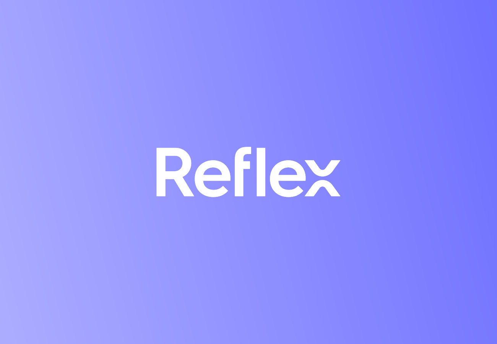

<div align="center">
  
</div>


**Reflex** is a sophisticated on-chain MEV (Maximum Extractable Value) capture engine designed for seamless integration into DEX protocols and AMM systems. Instead of letting external actors extract value, Reflex routes that value back into the protocol environment.

## 📁 Monorepo Structure

This repository is structured as a monorepo containing multiple packages:

```
reflex/
├── core/                   # Core Solidity contracts and Forge project
│   ├── src/               # Smart contracts
│   ├── test/              # Comprehensive test suite (373+ tests)
│   ├── script/            # Deployment and maintenance scripts
│   ├── lib/               # External dependencies (git submodules)
│   └── README.md          # Core package documentation
├── sdk/                   # TypeScript SDK for client integration
│   ├── src/               # SDK source code
│   ├── tests/             # SDK test suite (49+ tests)
│   ├── examples/          # Usage examples
│   └── README.md          # SDK documentation
├── website/               # Protocol documentation and website
│   ├── docs/              # Documentation content
│   ├── blog/              # Blog posts
│   ├── src/               # Website source
│   └── docusaurus.config.js # Site configuration
└── README.md             # This file (main documentation)
```

## 📦 Packages

### [Core Contracts](/core) (`/core`)

The foundational Solidity contracts that power the Reflex MEV system:

- **ReflexRouter**: Main router contract handling MEV capture execution and profit distribution
- **ConfigurableRevenueDistributor**: Integrated revenue distribution system with basis points precision
- **GracefulReentrancyGuard**: Custom reentrancy protection that gracefully exits instead of reverting
- **ReflexAfterSwap**: Integration base contracts for DEX protocols
- **Comprehensive Test Suite**: 373+ tests ensuring system reliability and security

[→ See Core Documentation](/core/README.md)

### [TypeScript SDK](/sdk) (`/sdk`)

Client-side integration library for developers:

- **ReflexSDK**: Main SDK class providing easy contract interaction
- **Type Definitions**: Full TypeScript support for all contract interfaces
- **Utility Functions**: Address validation, token formatting, profit calculations
- **Event Monitoring**: Real-time event watching and filtering
- **Well Tested**: 49+ tests covering all SDK functionality

[→ See SDK Documentation](/sdk/README.md)

## 🚀 Getting Started

### Prerequisites

- [Foundry](https://getfoundry.sh/) - Ethereum development toolkit
- [Node.js](https://nodejs.org/) - JavaScript runtime (for SDK)

### Installation

1. Clone the repository with submodules:

```bash
git clone --recursive https://github.com/reflex-mev/reflex.git
cd reflex
```

2. If you already cloned without submodules, initialize them:

```bash
git submodule update --init --recursive
```

### Quick Start

**Core contracts:**

```bash
cd core
forge build
forge test
```

**SDK:**

```bash
cd sdk
npm install
npm run build
npm test
```

For detailed setup and usage instructions, see the individual package READMEs:

- [Core Documentation](/core/README.md) - Smart contracts, deployment, and testing
- [SDK Documentation](/sdk/README.md) - TypeScript integration and examples

## 📚 Documentation

Comprehensive documentation is available at [reflex-mev.github.io/reflex](https://reflex-mev.github.io/reflex):

- **[🏗️ Architecture Overview](https://reflex-mev.github.io/reflex/architecture)** - System design and component interactions
- **[🔌 Integration Guide](https://reflex-mev.github.io/reflex/integration/overview)** - How to integrate Reflex into your protocol
- **[📖 API Reference](https://reflex-mev.github.io/reflex/api/smart-contracts)** - Complete API documentation for contracts and SDK
- **[🛡️ Security Policy](https://reflex-mev.github.io/reflex/security)** - Security guidelines and vulnerability reporting

## 🤝 Contributing

We welcome contributions from the community! Please see our [Contributing Guide](https://reflex-mev.github.io/reflex) for detailed instructions.

**Quick start:**

1. Fork the repository
2. Create a feature branch (`git checkout -b feature/amazing-feature`)
3. Make your changes and add tests
4. Ensure all tests pass
5. Commit your changes (`git commit -m 'Add amazing feature'`)
6. Push to the branch (`git push origin feature/amazing-feature`)
7. Open a Pull Request

For detailed development setup, testing procedures, and coding standards, see our [documentation](https://reflex-mev.github.io/reflex).

## 📄 License

This project is licensed under the MIT License - see the [LICENSE](LICENSE) file for details.

## 🔗 Related Projects

- [OpenZeppelin](https://github.com/OpenZeppelin/openzeppelin-contracts) - Security and utility contracts
- [Foundry](https://github.com/foundry-rs/foundry) - Development framework
- [Algebra Protocol](https://github.com/cryptoalgebra/AlgebraV1.9) - DEX infrastructure

## 📞 Support & Community

For questions, issues, or contributions:

- **📋 Issues**: [Open an issue](https://github.com/reflex-mev/reflex/issues/new/choose) for bugs or feature requests
- **💬 Discussions**: [GitHub Discussions](https://github.com/reflex-mev/reflex/discussions) for questions and ideas
- **📖 Documentation**: Check our [comprehensive docs](https://reflex-mev.github.io/reflex) for detailed guides
- **🔍 Examples**: Review the [examples directory](./examples) for implementation patterns
- **🛡️ Security**: Follow our [Security Policy](https://reflex-mev.github.io/reflex/security) for vulnerability reports
- **🐦 Twitter**: Follow [@ReflexMEV](https://x.com/ReflexMEV) for updates
- **📧 Email**: Contact us at team@reflexmev.io

## 🏷️ Badges & Status


---

**⚠️ Disclaimer**: This software is provided as-is. Users should conduct their own testing and security reviews before deploying to production environments.
