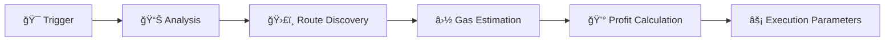
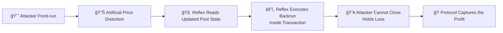

# Architecture

Understanding Reflex's architecture is key to building effective MEV capture strategies. This document provides a comprehensive overvieThis convertsThis converts natural slippage into captured value: reducing user cost, rewarding LPs, and preventing external arbitrageurs from extracting profit.

**Execution Flow:**

```mermaid
graph TD
    A[👤 User Swap] --> B[📉 Price Impact Created<br/>real AMM state]
    B --> C[🧠 Onchain Mispricing Detection]
    C --> D[⚡ Deterministic Arbitrage Execution<br/>in-transaction]
    D --> E[💰 Profit Captured Onchain]
    E --> F[🎁 Value Shared With<br/>User / LPs / Treasury]
```

### 2. Sandwich Attack Prevention — Structural Immunity into captured value: reducing user cost, rewarding LPs, and preventing external arbitrageurs from extracting profit.

**Execution Flow:**

### 2. Sandwich Attack Prevention — Structural Immunityesign, components, and data flow.

## 🏗️ High-Level Architecture

Reflex operates through a simple yet powerful architecture consisting of core smart contracts deployed per chain and multiple integration pathways for different entities. The system is designed to capture MEV opportunities and distribute profits fairly across the ecosystem.

### Core Components Per Chain

Each blockchain network has two core Reflex contracts:

**Reflex Router** - The central execution engine that coordinates all MEV capture activities. Handles MEV capture through `triggerBackrun()` for direct integrations and plugin-based systems.

**Reflex Quoter** - The analysis engine that detects MEV opportunities by analyzing price differences across DEX pools, calculating optimal arbitrage routes, and estimating profitability.

### On-chain Clients

Smart contracts that integrate directly with Reflex — with all logic executed fully on-chain, no external APIs, no latency, no trust assumptions.

**Plugin-based DEXes**

- Use hooks to automatically capture MEV immediately after user swaps
- Execution is fully on-chain, deterministic, and atomic

**Custom execution contracts**

- Integrate the Reflex router directly inside their core logic
- All calculations, routing, and profit distribution are done in-contract

**SwapProxy**

- Wraps any DEX router to add native MEV capture capabilities
- Zero external calls, zero off-chain dependencies

### Off-chain Clients

Backend and frontend systems that interact with Reflex — without ever relying on off-chain quoting, APIs, solvers, or trust assumptions. The SDK simply submits on-chain calls where all logic actually happens.

**Backend trading systems**

- Automated trading engines and MEV bots call the Reflex contracts directly through the SDK
- All MEV extraction, backrun logic, and settlement occur on-chain with no latency
- No need for off-chain quotes, no solvers, no probabilistic execution

**Frontend applications**

- DApps and interfaces provide MEV protection and aligned execution using SwapProxy
- No external services, no relayers, no private RPC requirements
- User flows trigger Reflex logic that executes 100% on-chain, inside the same transaction

### Key principle across the stack:

- **No external APIs** — No off-chain quoting or risk of stale prices
- **No trust in external solvers or builders**
- **No latency** — everything is synchronous and atomic on-chain

Reflex guarantees that MEV protection and MEV extraction both happen under the same rules, in the same transaction, with no external dependencies.

## 🧩 Core Components

### 1. Reflex Router

The central execution engine that coordinates all MEV capture activities. **One instance deployed per blockchain.**

**Key Responsibilities:**

- Executes MEV capture through two main entry points
- Coordinates with the quoter for profitability analysis
- Manages arbitrage execution for MEV capture
- Handles revenue distribution to configured recipients
- Maintains security through reentrancy protection

### 2. Reflex Quoter

The pricing and analysis engine that determines MEV opportunities. **One instance deployed per blockchain.**

**Key Responsibilities:**

- Analyzes price differences across DEX pools in real-time
- Calculates optimal arbitrage routes and execution paths
- Estimates gas costs and net profitability
- Provides execution parameters to the router
- Caches route data for efficiency

**Analysis Workflow:**

### 3. Integration Types

Reflex supports three main integration patterns:

1. **[Plugin-Based Integration](../integration/overview#1-dex-plugin-based-integration)** - For DEXes with hook/plugin support. Lightweight contracts automatically trigger MEV capture after user swaps.

2. **[Universal DEX Integration](../integration/overview#2-universal-dex-integration)** - For any DEX and client-side applications. Uses SwapProxy + TypeScript SDK to wrap any DEX router with MEV capture.

3. **[Direct Contract Access](../integration/overview#3-direct-contract-access)** - For custom smart contracts. Direct calls to `ReflexRouter.triggerBackrun()` with full control over MEV capture timing.

[→ View Detailed Integration Guide](../integration/overview)

## 🔄 Transaction Flow

### Standard Backrun Flow

## 💡 Capabilities

### 1. Slippage Correction — Deterministic Arbitrage Execution

Reflex turns every swap-induced price impact into an internal arbitrage opportunity.

After the user swap executes, Reflex analyzes the updated pool state, detects mispricing, and performs an optimal arbitrage backrun inside the same transaction.

**No solvers, no offchain quotes, no latency.**  
All logic is fully onchain.

This converts natural slippage into captured value: reducing user cost, rewarding LPs, and preventing external arbitrageurs from extracting profit.

**Execution Flow:**

👤 User Swap  
⬇️  
📉 Price Impact Created (real AMM state)  
⬇️  
🧠 Onchain Mispricing Detection  
⬇️  
⚡ Deterministic Arbitrage Execution (in-transaction)  
⬇️  
� Profit Captured Onchain  
⬇️  
🎁 Value Shared With User / LPs / Treasury

### 2. Sandwich Attack Prevention — Structural Immunity

Reflex makes sandwich attacks economically impossible.

A sandwich only works if the attacker can close their position after the user swap. Reflex removes this closing leg entirely by executing its own backrun inside the user's transaction, leaving no opening for attackers.

If someone front-runs the user, Reflex immediately captures the artificial imbalance they created.  
The attacker is stuck in a toxic position with no exit, and the profit flows back to the protocol.

**Execution Flow:**

## 🛡️ Security Architecture

### Reflex Security

Reflex implements multiple security layers to ensure safe and reliable MEV operations:

**Failsafe Mechanisms** - Built-in safety checks that prevent execution if profitability thresholds aren't met or if gas costs exceed expected limits. All operations can be safely reverted without affecting user transactions.

**Independent Operation** - Reflex operates completely independently from protocol and user swaps. The system has no access to user funds or protocol treasuries, only capturing MEV through legitimate arbitrage opportunities.

**Reentrancy Protection** - All router functions implement strict reentrancy guards to prevent malicious contracts from exploiting callback mechanisms during MEV executions.

**Access Controls** - Granular permission system ensures only authorized contracts can trigger specific functions, with different access levels for plugins, direct integrations, and administrative operations.

### Risk Mitigation

1. **Reentrancy Protection**: Protected by reentrancy guards and callback validation
2. **Unauthorized Access**: Role-based permissions prevent malicious contract interactions
3. **Fund Safety**: No direct access to user or protocol funds - only captures public arbitrage opportunities
4. **Execution Failures**: Comprehensive failsafe mechanisms ensure failed MEV attempts don't impact user transactions

## 🔧 Gas Optimization

### Efficient Profit Detection

Reflex implements a multi-stage gas optimization strategy that minimizes costs while maximizing MEV capture efficiency:

**Stage 1: Profit Check (Minimal Gas)** - Initial profitability assessment adds virtually no gas overhead. This lightweight check determines if an MEV opportunity exists without committing to expensive calculations.

**Stage 2: Route Optimization (Moderate Gas)** - When profitable opportunities are detected, the system performs detailed route calculations and profit estimations. This includes optimal path discovery, gas cost analysis, and net profit calculations.

**Stage 3: Swap Execution (Variable Gas)** - Actual MEV capture execution with gas costs dependent on the selected arbitrage route. Multi-hop swaps require additional gas per DEX interaction.

### Gas Economics

**Profitability Guarantee** - All executed backruns are profitable by design, ensuring gas costs are always covered by captured MEV profits. Failed profitability checks prevent unprofitable executions.

**User Gas Rebates** - A portion of captured MEV profits is automatically shared with users to offset their original transaction gas costs, providing net positive value.

### Gas Limit Recommendations

**Recommended Gas Limit** - For optimal MEV capture, we recommend setting a gas limit of 1.5M gas for most transactions, this provides sufficient headroom for profitable MEV operations.

## 🌐 Multi-Chain Architecture

Reflex is designed to work across multiple blockchain networks and supported by over 180 EVM chains.

---

This architecture enables Reflex to provide efficient, secure, and fair MEV capture that benefits all participants in the DeFi ecosystem. The modular design allows for easy integration with existing protocols while maintaining the flexibility to adapt to future innovations.

For implementation details, see our [Integration Guide](./integration/overview) and [API Reference](./api/smart-contracts).
