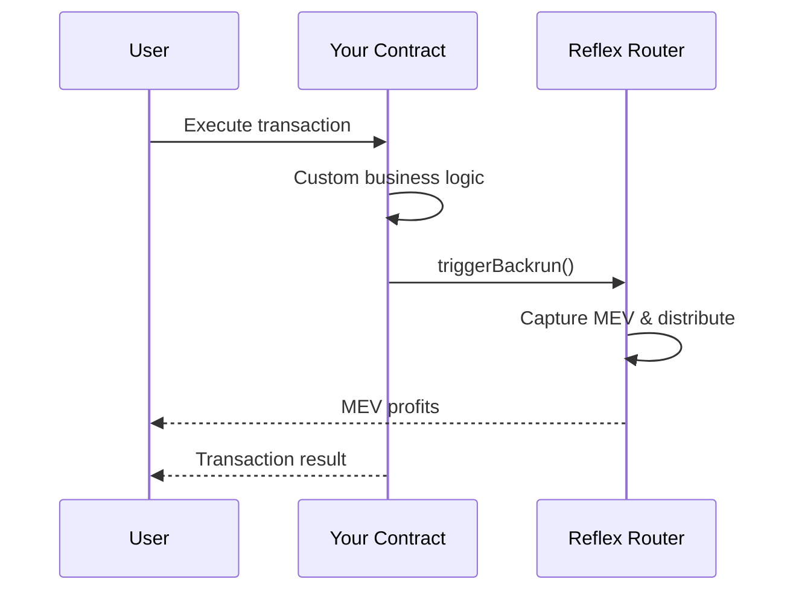

# Direct Contract Access

Integrate Reflex MEV capture by calling the Router directly from your custom smart contracts.

## Overview

Direct Contract Access provides maximum flexibility for custom integrations. Your smart contract calls `triggerBackrun()` directly on the ReflexRouter to capture MEV opportunities on-demand.

**Best for:**

- ✅ Custom DeFi protocols with unique architectures
- ✅ Applications requiring fine-grained MEV control
- ✅ Conditional MEV capture based on custom logic
- ✅ Advanced integration scenarios

## How It Works



### Key Features

- **Full Control**: Decide exactly when and how to trigger MEV capture
- **Custom Logic**: Integrate MEV capture with any business logic
- **Flexible Configuration**: Choose backrun parameters per transaction
- **Direct Integration**: No intermediary contracts required

## Implementation

### Basic Integration

```solidity
pragma solidity ^0.8.19;

import "@reflex/interfaces/IReflexRouter.sol";

contract MyDeFiProtocol {
    IReflexRouter public immutable reflexRouter;
    bytes32 public immutable configId;

    constructor(address _reflexRouter, bytes32 _configId) {
        reflexRouter = IReflexRouter(_reflexRouter);
        configId = _configId;
    }

    function executeSwapWithMEV(
        address tokenIn,
        address tokenOut,
        uint256 amountIn,
        uint256 minAmountOut
    ) external returns (uint256 amountOut) {
        // Your custom swap logic
        amountOut = _executeSwap(tokenIn, tokenOut, amountIn, minAmountOut);

        // Trigger MEV capture after swap
        bytes32 poolId = _getPoolId(tokenIn, tokenOut);
        uint112 backrunAmount = uint112(amountIn);

        try reflexRouter.triggerBackrun(
            poolId,
            backrunAmount,
            true, // zeroForOne
            msg.sender,
            configId
        ) returns (uint256 profit, address profitToken) {
            emit MEVCaptured(msg.sender, profit, profitToken);
        } catch {
            // Silently fail - don't revert user transaction
            emit MEVCaptureFailed(msg.sender);
        }

        return amountOut;
    }

    function _executeSwap(
        address tokenIn,
        address tokenOut,
        uint256 amountIn,
        uint256 minAmountOut
    ) internal returns (uint256) {
        // Your swap implementation
    }

    function _getPoolId(address token0, address token1) internal pure returns (bytes32) {
        // Your pool ID logic
    }

    event MEVCaptured(address indexed user, uint256 profit, address profitToken);
    event MEVCaptureFailed(address indexed user);
}
```

## Best Practices

### 1. Error Handling

Always use try/catch to prevent MEV failures from affecting user transactions:

```solidity
try reflexRouter.triggerBackrun(...) {
    // Success
} catch {
    // Log failure but don't revert
    emit MEVCaptureFailed(msg.sender);
}
```

### 2. Gas Optimization

- Cache frequently used values
- Use efficient pool ID calculations
- Consider batching MEV triggers when possible

```solidity
// ❌ Bad: Recalculate poolId every time
function badExample(address token0, address token1) external {
    bytes32 poolId = keccak256(abi.encodePacked(token0, token1));
    reflexRouter.triggerBackrun(poolId, ...);
}

// ✅ Good: Cache poolId
mapping(bytes32 => bytes32) public poolIds;

function goodExample(address token0, address token1) external {
    bytes32 key = keccak256(abi.encodePacked(token0, token1));
    bytes32 poolId = poolIds[key];

    if (poolId == bytes32(0)) {
        poolId = _calculatePoolId(token0, token1);
        poolIds[key] = poolId;
    }

    reflexRouter.triggerBackrun(poolId, ...);
}
```

### 3. Security

- Validate all user inputs
- Use reentrancy guards where appropriate
- Implement access controls for sensitive functions

```solidity
import "@openzeppelin/contracts/security/ReentrancyGuard.sol";

contract SecureProtocol is ReentrancyGuard {
    function executeSwapWithMEV(...) external nonReentrant {
        // Protected from reentrancy
    }
}
```

### 4. Monitoring

Emit events for off-chain monitoring:

```solidity
event MEVCaptured(
    address indexed user,
    uint256 profit,
    address profitToken,
    bytes32 poolId,
    uint256 backrunAmount
);

event MEVCaptureFailed(
    address indexed user,
    bytes32 poolId,
    string reason
);
```

## Troubleshooting

### Transaction Reverts

If transactions revert unexpectedly:

1. Ensure proper try/catch around `triggerBackrun()`
2. Check gas limits are sufficient
3. Verify pool ID is correct
4. Confirm Router address is correct

### MEV Not Captured

If MEV capture fails silently:

1. Check event logs for `MEVCaptureFailed` events
2. Verify pool has sufficient liquidity
3. Ensure backrun amount is within reasonable bounds
4. Test profitability threshold requirements

---

**Next Steps:**

- [View API Reference](../api/reflex-router) - Complete Router documentation
- [Read Architecture Guide](../architecture) - Understand system design
- [Explore Other Integration Methods](./overview) - Compare integration options
