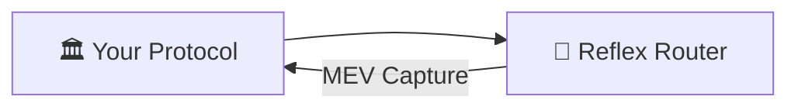
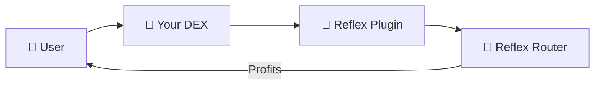
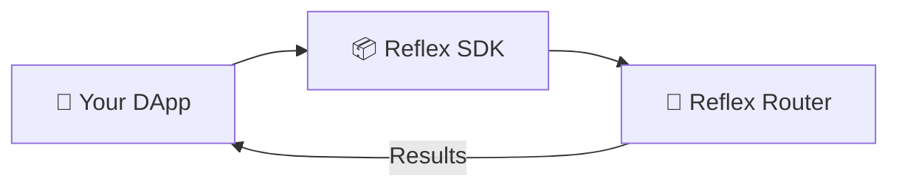

# Integration Overview

Learn how to integrate Reflex Protocol into your DeFi protocol to capture and distribute MEV fairly among your users.

## 🎯 Integration Types

Reflex offers two main integration approaches depending on your use case and technical requirements:

## 1. Smart Contract Integration

For protocols and DEXs that want to integrate MEV capture directly into their smart contracts.

### Router Direct Access

Integrate directly with the Reflex Router for full control over MEV capture:

**Best for:**

- ✅ New protocol development
- ✅ Deep MEV integration
- ✅ Custom revenue models
- ✅ Protocol-level optimization

**How it works:**
Your smart contract calls the Reflex Router directly to trigger backrun opportunities. This gives you complete control over when and how MEV is captured.

### Plugin-Based Access

Deploy a lightweight plugin contract that automatically captures MEV from swaps:

**Best for:**

- ✅ Existing DEX protocols
- ✅ Minimal code changes required
- ✅ Automatic MEV capture
- ✅ Hook/callback architectures

**How it works:**
A plugin contract integrates with your existing DEX using hooks or callbacks (like `afterSwap`). When users trade, the plugin automatically triggers MEV capture opportunities.

## 2. SDK Integration

For clients, DApps, and custom applications that want to integrate MEV capture functionality.

### TypeScript SDK

Use the TypeScript SDK for custom MEV strategies and manual triggers:

**Best for:**

- ✅ Frontend applications
- ✅ MEV bots and searchers
- ✅ Custom trading strategies
- ✅ Multi-chain operations
- ✅ Advanced profit optimization

**How it works:**
Your application uses the Reflex SDK to monitor transactions, detect MEV opportunities, and execute backruns programmatically. Perfect for building sophisticated MEV strategies or integrating MEV capture into user-facing applications.

## 🎛️ Revenue Configuration

All integration types use Reflex's centralized revenue configuration system:

**Default Configuration:**
- 80% to Reflex Protocol
- 20% to users/traders

**Custom Configuration:**
For protocols requiring different profit distribution, contact the Reflex team to set up a custom revenue sharing structure. You'll receive a unique `configId` to use in your integration.

[Learn more about Revenue Configuration →](./revenue-configuration)

---

For more detailed implementation guidance, see our [Smart Contract Integration](./smart-contract) and [SDK Integration](./sdk-integration) guides, and check our [API Reference](../api/smart-contracts).
