# Overview

Learn how to integrate Reflex into your DeFi protocol to capture and distribute MEV fairly among your users.

## 🎯 Integration Types

Reflex offers three primary integration methods to suit different protocol architectures and use cases:

---

## 1. DEX Plugin-Based Integration

**For DEXes with hook/plugin support**

Automatic MEV capture through native protocol hooks and callbacks.

```mermaid
graph LR
    User[👤 User] --> |Swap| DEX[DEX]
    DEX --> Plugin[🔌 Reflex Plugin]
    Plugin -->|Trigger Backrun| Router[🎯 Reflex Router]
```

### Best for:

- ✅ Existing DEX protocols with plugin/hook systems
- ✅ Algebra, PancakeSwap Infinity, Uniswap v4 architectures
- ✅ Minimal code changes required
- ✅ Automatic MEV capture and distribution

### How it works:

A lightweight plugin contract integrates with your DEX using native hooks (like `afterSwap`). When users trade, the plugin automatically detects profitable MEV opportunities and triggers backrun execution. The plugin inherits from `ReflexAfterSwap` base contract, which handles all the MEV capture logic.

### Key Features:

- **Zero DEX Modifications**: Plugin sits alongside your existing pool contracts
- **Automatic Triggering**: Every swap is analyzed for MEV opportunities
- **Configurable Thresholds**: Set minimum swap sizes and backrun ratios
- **Failsafe Design**: Failed MEV attempts don't affect user swaps

[→ View Plugin Integration Guide](./smart-contract#plugin-based-access)

---

## 2. Universal DEX Integration

**For any DEX and client-side applications**

Wrap any DEX router with MEV capture using a proxy contract and TypeScript SDK.

```mermaid
graph LR
    User[👤 User] --> DApp[📱 Your DApp/Frontend]
    DApp --> SDK[📦 Reflex SDK]
    SDK --> Proxy[🔄 SwapProxy]
    Proxy --> |1. Execute Swap| DEX[🏪 Target DEX Router]
    Proxy --> |2. Trigger Backrun| Router[🎯 Reflex Router]
```

### Best for:

- ✅ Legacy DEXes without plugin/hook support
- ✅ Frontend applications and DApp interfaces
- ✅ MEV bots and automated trading strategies
- ✅ Multi-chain operations
- ✅ No changes to underlying DEX required

### How it works:

The `BackrunEnabledSwapProxy` contract wraps any existing DEX router. Users approve tokens to the proxy instead of the DEX directly. The proxy executes the swap on the target DEX, then immediately triggers backrun operations—all in a single atomic transaction. The TypeScript SDK provides a simple interface for client-side integration.

### Key Features:

- **Universal Compatibility**: Works with any DEX router contract
- **Atomic Execution**: Swap + backrun in one transaction
- **TypeScript SDK**: Easy integration for frontend developers
- **No DEX Changes**: Requires zero modifications to underlying DEX
- **Client-Side Control**: Full control from your application code

### Components:

**BackrunEnabledSwapProxy Contract:**

- Wraps target DEX router
- Handles token approvals and transfers
- Executes swap + backrun atomically
- Returns leftover tokens and ETH to users

**ReflexSDK (TypeScript):**

- Simple API for contract interaction
- Event monitoring and filtering
- Transaction simulation
- Multi-chain support
- Type-safe interfaces

[→ View SDK Integration Guide](./sdk-integration)

---

## 3. Direct Contract Access

**For general contract developers**

Full control over MEV capture timing and logic through direct router calls.

```mermaid
graph LR
    User[👤 User] --> Protocol[🏛️ Your Contract]
    Protocol --> |1. Execute Logic| Protocol
    Protocol --> |2. Trigger Backrun| Router[🎯 Reflex Router]
```

### Best for:

- ✅ New protocol development from scratch
- ✅ Custom DEX implementations
- ✅ Precise control over MEV capture timing
- ✅ Custom revenue distribution models
- ✅ Any smart contract wanting MEV integration

### How it works:

Your smart contract calls `ReflexRouter.triggerBackrun()` directly within your protocol logic. You determine exactly when to attempt MEV capture based on your specific requirements—after swaps, trades, or any other state-changing operation.

### Key Features:

- **Full Flexibility**: Trigger MEV capture at any point in your contract logic
- **Custom Parameters**: Configure trigger amounts, recipients, and revenue splits per call
- **Direct Integration**: No intermediate contracts or proxies
- **Protocol-Level Control**: Implement custom MEV strategies specific to your protocol

[→ View Direct Access Integration Guide](./smart-contract#router-direct-access)

---

For more detailed implementation guidance, see our [Smart Contract Integration](./smart-contract) and [SDK Integration](./sdk-integration) guides, and check our [API Reference](../api/smart-contracts).
