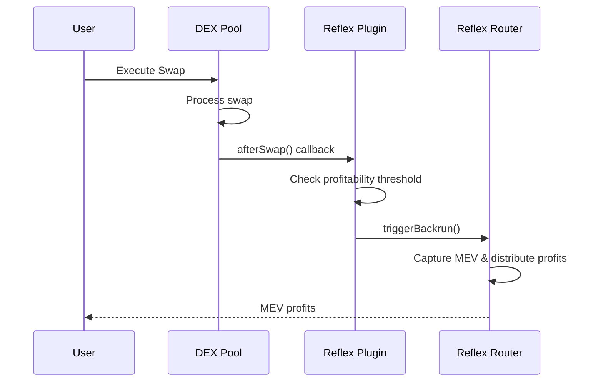

# Plugin-Based Integration

Integrate Reflex MEV capture into DEXes with hook/plugin support using lightweight plugin contracts.

## Overview

Plugin-based integration is ideal for existing DEX protocols that support hooks or callbacks (like `afterSwap`). A lightweight plugin contract automatically triggers MEV capture after user swaps without requiring modifications to your core DEX contracts.

**Best for:**
- ✅ Algebra, PancakeSwap Infinity, Uniswap v4 architectures
- ✅ Existing DEX protocols with plugin/hook systems
- ✅ Minimal code changes required
- ✅ Automatic MEV capture and distribution

## How It Works



### Key Features

- **Zero DEX Modifications**: Plugin sits alongside your existing pool contracts
- **Automatic Triggering**: Every swap is analyzed for MEV opportunities
- **Configurable Thresholds**: Set minimum swap sizes and backrun ratios
- **Failsafe Design**: Failed MEV attempts don't affect user swaps

## Implementation

### 1. Algebra-Based Plugin

For Algebra Integral pools:

```solidity
pragma solidity ^0.8.19;

import "@reflex/contracts/ReflexAfterSwap.sol";

contract AlgebraReflexPlugin is ReflexAfterSwap {
    address public immutable pool;

    constructor(
        address _reflexRouter,
        address _pool,
        bytes32 _configId
    ) ReflexAfterSwap(_reflexRouter, _configId) {
        pool = _pool;
    }

    function afterSwap(
        address sender,
        int256 amount0,
        int256 amount1,
        uint160 currentPrice,
        uint128 currentLiquidity,
        int24 currentTick,
        bytes calldata data
    ) external {
        require(msg.sender == pool, "Only pool can call");
        
        // Use the base contract's _reflexAfterSwap function
        _reflexAfterSwap(
            bytes32(uint256(uint160(pool))), // triggerPoolId
            amount0,                          // amount0Delta
            amount1,                          // amount1Delta
            amount0 > 0,                      // zeroForOne
            sender                            // recipient
        );
    }

    function _onlyReflexAdmin() internal view override {
        // Implement admin access control
        // Example: require(msg.sender == admin, "Only admin");
    }
}
```

### 2. PancakeSwap Infinity Plugin

For PancakeSwap Infinity pools (uses Algebra-based architecture):

```solidity
pragma solidity ^0.8.19;

import "@reflex/contracts/ReflexAfterSwap.sol";

contract PancakeSwapInfinityReflexPlugin is ReflexAfterSwap {
    address public immutable pool;

    constructor(
        address _reflexRouter,
        address _pool,
        bytes32 _configId
    ) ReflexAfterSwap(_reflexRouter, _configId) {
        pool = _pool;
    }

    function afterSwap(
        address sender,
        int256 amount0,
        int256 amount1,
        uint160 currentPrice,
        uint128 currentLiquidity,
        int24 currentTick,
        bytes calldata data
    ) external {
        require(msg.sender == pool, "Only pool can call");
        
        // Use the base contract's _reflexAfterSwap function
        _reflexAfterSwap(
            bytes32(uint256(uint160(pool))), // triggerPoolId
            amount0,                          // amount0Delta
            amount1,                          // amount1Delta
            amount0 > 0,                      // zeroForOne
            sender                            // recipient
        );
    }

    function _onlyReflexAdmin() internal view override {
        // Implement admin access control
        // Example: require(msg.sender == admin, "Only admin");
    }
}
```

### 3. Uniswap V4 Hook

For Uniswap V4 pools:

```solidity
pragma solidity ^0.8.19;

import {BaseHook} from "v4-periphery/BaseHook.sol";
import {IPoolManager} from "v4-core/interfaces/IPoolManager.sol";
import {PoolKey} from "v4-core/types/PoolKey.sol";
import {BalanceDelta} from "v4-core/types/BalanceDelta.sol";
import {Hooks} from "v4-core/libraries/Hooks.sol";
import "@reflex/contracts/ReflexAfterSwap.sol";

contract UniswapV4ReflexHook is BaseHook, ReflexAfterSwap {
    constructor(
        IPoolManager _poolManager,
        address _reflexRouter,
        bytes32 _configId
    ) BaseHook(_poolManager) ReflexAfterSwap(_reflexRouter, _configId) {}

    function afterSwap(
        address sender,
        PoolKey calldata key,
        IPoolManager.SwapParams calldata params,
        BalanceDelta delta,
        bytes calldata hookData
    ) external override returns (bytes4) {
        // Use the base contract's _reflexAfterSwap function
        _reflexAfterSwap(
            keccak256(abi.encode(key)),      // triggerPoolId
            delta.amount0(),                  // amount0Delta
            delta.amount1(),                  // amount1Delta
            params.zeroForOne,                // zeroForOne
            sender                            // recipient
        );

        return BaseHook.afterSwap.selector;
    }

    function getHookPermissions() public pure override returns (Hooks.Permissions memory) {
        return Hooks.Permissions({
            beforeInitialize: false,
            afterInitialize: false,
            beforeAddLiquidity: false,
            afterAddLiquidity: false,
            beforeRemoveLiquidity: false,
            afterRemoveLiquidity: false,
            beforeSwap: false,
            afterSwap: true,
            beforeDonate: false,
            afterDonate: false
        });
    }

    function _onlyReflexAdmin() internal view override {
        // Implement admin access control
        // Example: require(msg.sender == admin, "Only admin");
    }
}
```

## Configuration

### Register Plugin with Pool

For Algebra pools:

```solidity
// As pool owner/admin
pool.setPlugin(pluginAddress);
```

For Uniswap V4:

```solidity
// Deploy with hook address in pool key
PoolKey memory key = PoolKey({
    currency0: currency0,
    currency1: currency1,
    fee: fee,
    tickSpacing: tickSpacing,
    hooks: IHooks(hookAddress)
});
```

## Best Practices

### 1. Monitoring

Listen for MEV capture events from the ReflexRouter:

```solidity
// Listen to BackrunExecuted event from ReflexRouter
event BackrunExecuted(
    bytes32 indexed poolId,
    address indexed user,
    uint256 profit,
    address profitToken,
    bytes32 indexed configId
);
```

You can filter these events by your pool ID or config ID to monitor MEV captures for your integration.

### 2. Testing

Always test your plugin integration thoroughly:

```solidity
// Test small swaps
// Test large swaps
// Test failsafe behavior
```

### 3. Security

- Use `try/catch` to prevent plugin failures from affecting swaps
- Implement proper access controls for admin functions
- Monitor plugin behavior and adjust as needed

## Troubleshooting

### Plugin Not Triggering

1. Verify plugin is registered with the pool
2. Check that swaps are being executed through the pool
3. Verify the plugin's `afterSwap` hook is being called

### Failed Backruns

1. Check gas limits are sufficient
2. Review event logs for failure reasons

---

**Next Steps:**

- [View API Reference](../api/smart-contracts) - Complete contract documentation
- [Read Architecture Guide](../architecture) - Understand the system design
- [Explore Other Integration Methods](./overview) - Compare integration options
