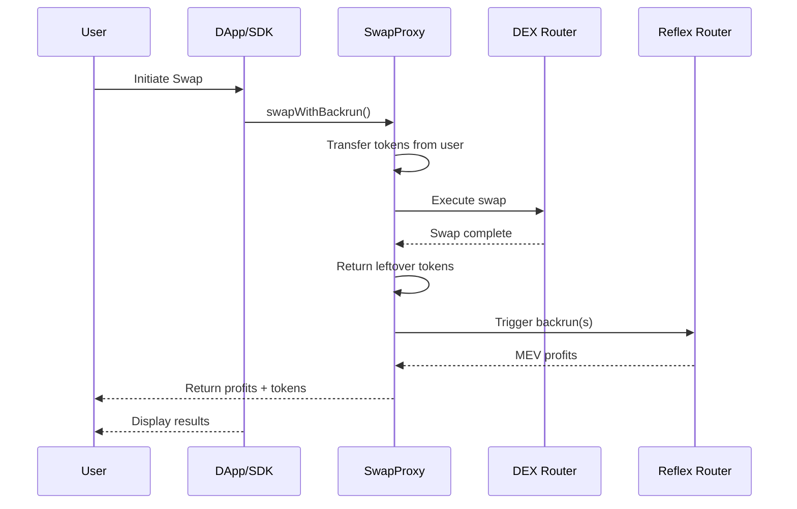

# Universal DEX Integration

Integrate Reflex MEV capture into any DEX and client applications using the TypeScript SDK and `BackrunEnabledSwapProxy` contract.

## Overview

The Universal DEX integration method enables MEV capture for:

- **Legacy DEXes** that don't support hooks/plugins
- **Frontend applications** and DApp interfaces
- **MEV bots** and automated trading strategies
- **Any DEX router** without requiring code changes

This approach uses a proxy contract to wrap existing DEX routers, combined with a TypeScript SDK for easy client-side integration.

## Architecture



## Components

### 1. BackrunEnabledSwapProxy Contract

A smart contract that wraps any existing DEX router and adds MEV capture functionality.

**Key Features:**

- Works with any DEX router (Uniswap, SushiSwap, PancakeSwap, etc.)
- Atomic swap + backrun execution
- Automatic token approval management
- Returns leftover tokens and ETH to users
- Reentrancy protected

**Deployment:**
One proxy contract per target DEX router you want to support.

### 2. ReflexSDK (TypeScript)

A client-side library that simplifies interaction with the SwapProxy and Reflex contracts.

**Key Features:**

- Type-safe interfaces
- Event monitoring
- Transaction simulation
- Multi-chain support
- Error handling

## Quick Start

### Step 1: Deploy SwapProxy (One-time Setup)

Deploy a `BackrunEnabledSwapProxy` contract for your target DEX router:

```solidity
// Deploy via Foundry script or directly
import {BackrunEnabledSwapProxy} from "@reflex/contracts/integrations/router/BackrunEnabledSwapProxy.sol";

// Constructor takes the target DEX router address
BackrunEnabledSwapProxy proxy = new BackrunEnabledSwapProxy(
    0x7a250d5630B4cF539739dF2C5dAcb4c659F2488D  // Uniswap V2 Router
);
```

Or use the provided deployment script:

```bash
# Set environment variables
export TARGET_ROUTER_ADDRESS=0x7a250d5630B4cF539739dF2C5dAcb4c659F2488D

# Deploy
forge script script/deploy-swap-proxy/DeployBackrunEnabledSwapProxy.s.sol \
    --rpc-url <YOUR_RPC_URL> \
    --private-key <YOUR_PRIVATE_KEY> \
    --broadcast
```

### Step 2: Install SDK

```bash
npm install @reflex-mev/sdk ethers
# or
yarn add @reflex-mev/sdk ethers
```

### Step 3: Initialize SDK

```typescript
import { ReflexSDK } from "@reflex-mev/sdk";
import { ethers } from "ethers";

// Initialize provider and signer
const provider = new ethers.JsonRpcProvider(
  "https://mainnet.infura.io/v3/YOUR_KEY"
);
const signer = new ethers.Wallet("YOUR_PRIVATE_KEY", provider);

// Create SDK instance with Reflex Router address
const reflex = new ReflexSDK(
  provider,
  signer,
  "0xYourReflexRouterAddress" // Reflex Router (per chain)
);
```

## SwapProxy Integration

### Basic Swap with MEV Capture

```typescript
import { BackrunEnabledSwapProxy__factory } from "@reflex-mev/sdk";

// Connect to your deployed SwapProxy
const swapProxy = BackrunEnabledSwapProxy__factory.connect(
  "0xYourSwapProxyAddress",
  signer
);

// Prepare swap metadata
const swapMetadata = {
  swapTxCallData: "0x...", // Encoded swap call for target DEX
  tokenIn: "0xTokenInAddress",
  amountIn: ethers.parseEther("1.0"),
  tokenOut: "0xTokenOutAddress",
  recipient: userAddress,
};

// Prepare backrun parameters
const backrunParams = [
  {
    triggerPoolId: "0xPoolAddress",
    swapAmountIn: ethers.parseEther("0.05"), // 5% of swap for backrun
    token0In: true,
    recipient: userAddress,
    configId: "0x...", // Your revenue config ID
  },
];

// Execute swap with automatic MEV capture
const tx = await swapProxy.swapWithBackrun(
  swapMetadata.swapTxCallData,
  swapMetadata,
  "0xReflexRouterAddress",
  backrunParams,
  { value: ethers.parseEther("0.1") } // If swap requires ETH
);

const receipt = await tx.wait();
console.log("Swap + MEV capture complete:", receipt.hash);
```

## DApp Integration with SwapProxy

### Frontend Integration

```typescript
// React hook for MEV-enabled swaps via SwapProxy
import { useState, useEffect, useCallback } from "react";
import { ethers } from "ethers";
import { BackrunEnabledSwapProxy__factory } from "@reflex-mev/sdk";

export function useReflexSwapProxy(
  provider,
  signer,
  swapProxyAddress,
  reflexRouterAddress
) {
  const [swapProxy, setSwapProxy] = useState(null);
  const [isReady, setIsReady] = useState(false);

  useEffect(() => {
    if (provider && signer && swapProxyAddress) {
      const proxy = BackrunEnabledSwapProxy__factory.connect(
        swapProxyAddress,
        signer
      );
      setSwapProxy(proxy);
      setIsReady(true);
    }
  }, [provider, signer, swapProxyAddress]);

  const executeSwapWithMEV = useCallback(
    async (swapParams) => {
      if (!swapProxy || !isReady) {
        throw new Error("SwapProxy not initialized");
      }

      try {
        // Encode the swap call for the target DEX
        // This example assumes Uniswap V2-like interface
        const targetDexInterface = new ethers.Interface([
          "function swapExactTokensForTokens(uint amountIn, uint amountOutMin, address[] path, address to, uint deadline)",
        ]);

        const swapCallData = targetDexInterface.encodeFunctionData(
          "swapExactTokensForTokens",
          [
            swapParams.amountIn,
            swapParams.amountOutMin,
            swapParams.path,
            swapParams.recipient,
            Math.floor(Date.now() / 1000) + 60 * 20, // 20 min deadline
          ]
        );

        // Prepare swap metadata
        const swapMetadata = {
          swapTxCallData: swapCallData,
          tokenIn: swapParams.tokenIn,
          amountIn: swapParams.amountIn,
          tokenOut: swapParams.tokenOut,
          recipient: swapParams.recipient,
        };

        // Prepare backrun parameters
        const backrunParams = [
          {
            triggerPoolId: swapParams.poolAddress,
            swapAmountIn: swapParams.amountIn / 20n, // 5% for backrun
            token0In: swapParams.tokenIn < swapParams.tokenOut,
            recipient: swapParams.recipient,
            configId: swapParams.configId || ethers.ZeroHash,
          },
        ];

        // Approve tokens to SwapProxy
        const tokenContract = new ethers.Contract(
          swapParams.tokenIn,
          ["function approve(address spender, uint256 amount) returns (bool)"],
          signer
        );

        const approveTx = await tokenContract.approve(
          swapProxyAddress,
          swapParams.amountIn
        );
        await approveTx.wait();

        // Execute swap with MEV capture
        const tx = await swapProxy.swapWithBackrun(
          swapMetadata.swapTxCallData,
          swapMetadata,
          reflexRouterAddress,
          backrunParams,
          { value: swapParams.ethValue || 0 }
        );

        const receipt = await tx.wait();

        // Parse events to get profit information
        // The SwapProxy doesn't emit events, but ReflexRouter does
        const profits = [];
        const profitTokens = [];

        // You can parse BackrunExecuted events from ReflexRouter here
        // or call a view function to check balances

        return {
          success: receipt.status === 1,
          transactionHash: receipt.hash,
          profits,
          profitTokens,
        };
      } catch (error) {
        console.error("Swap with MEV failed:", error);
        throw error;
      }
    },
    [swapProxy, isReady, swapProxyAddress, reflexRouterAddress, signer]
  );

  return {
    swapProxy,
    executeSwapWithMEV,
    isReady,
  };
}
```

````

### Trading Interface Component

```typescript
// MEV-enabled trading component using SwapProxy
import React, { useState } from "react";
import { ethers } from "ethers";

export function MEVTradingInterface({
  provider,
  signer,
  swapProxyAddress,
  reflexRouterAddress
}) {
  const { executeSwapWithMEV, isReady } = useReflexSwapProxy(
    provider,
    signer,
    swapProxyAddress,
    reflexRouterAddress
  );

  const [swapAmount, setSwapAmount] = useState("");
  const [isSwapping, setIsSwapping] = useState(false);
  const [selectedTokenIn, setSelectedTokenIn] = useState(null);
  const [selectedTokenOut, setSelectedTokenOut] = useState(null);

  const handleSwap = async () => {
    if (!selectedTokenIn || !selectedTokenOut) {
      alert("Please select tokens");
      return;
    }

    setIsSwapping(true);

    try {
      const result = await executeSwapWithMEV({
        tokenIn: selectedTokenIn.address,
        tokenOut: selectedTokenOut.address,
        amountIn: ethers.parseUnits(swapAmount, selectedTokenIn.decimals),
        amountOutMin: 0n,  // Set appropriate slippage
        path: [selectedTokenIn.address, selectedTokenOut.address],
        poolAddress: "0xPoolAddress",  // The pool being traded on
        recipient: await signer.getAddress(),
        configId: ethers.ZeroHash,  // Use default config or your custom config
        ethValue: 0  // Set if swap involves ETH
      });

      if (result.success) {
        showNotification({
          type: "success",
          title: "Swap Completed!",
          message: `Transaction: ${result.transactionHash.slice(0, 10)}...`
        });

        if (result.profits.length > 0 && result.profits[0] > 0n) {
          showNotification({
            type: "success",
            title: "MEV Bonus Captured!",
            message: `You received an additional ${ethers.formatEther(
              result.profits[0]
            )} tokens from MEV`
          });
        }
      }
    } catch (error) {
      showNotification({
        type: "error",
        title: "Swap Failed",
        message: error.message
      });
    } finally {
      setIsSwapping(false);
    }
  };

  return (
    <div className="trading-interface">
      <h2>Swap with MEV Protection</h2>

      {/* Token Selection */}
      <div className="token-inputs">
        <input
          type="number"
          value={swapAmount}
          onChange={(e) => setSwapAmount(e.target.value)}
          placeholder="Amount to swap"
        />
        {/* Add token selectors here */}
      </div>

      {/* Swap Button */}
      <button
        onClick={handleSwap}
        disabled={!isReady || isSwapping || !swapAmount}
        className="swap-button"
      >
        {isSwapping ? "Swapping..." : "Swap with MEV Capture"}
      </button>

      {/* Info */}
      <div className="swap-info">
        <p>✅ Automatic MEV capture enabled</p>
        <p>✅ Protected from sandwich attacks</p>
        <p>✅ Profits returned to you</p>
      </div>
    </div>
  );
}
````

## Advanced: Direct SDK Usage (Without SwapProxy)

For advanced use cases where you want to use the SDK directly without the SwapProxy:

### Using backrunedExecute

The `backrunedExecute` function allows you to execute any transaction and trigger backruns atomically:

```typescript
import { ReflexSDK } from "@reflex-mev/sdk";

// Initialize SDK
const reflex = new ReflexSDK(provider, signer, reflexRouterAddress);

// Prepare your transaction as executeParams
const executeParams = {
  target: "0xTargetContractAddress", // Any contract
  value: 0n, // ETH to send
  callData: "0x...", // Encoded function call
};

// Prepare backrun parameters
const backrunParams = [
  {
    triggerPoolId: "0xPoolId",
    swapAmountIn: ethers.parseEther("0.1"),
    token0In: true,
    recipient: userAddress,
    configId: ethers.ZeroHash,
  },
];

// Execute + backrun atomically
const result = await reflex.backrunedExecute(executeParams, backrunParams, {
  gasLimit: 1500000n,
});

console.log("Transaction:", result.transactionHash);
console.log("Profits:", result.profits);
console.log("Profit tokens:", result.profitTokens);
```

## SwapProxy Deployment Guide

### Deploying for Your DEX

Deploy a SwapProxy for each DEX router you want to support:

```bash
# Clone the Reflex repository
git clone --recursive https://github.com/reflex-mev/reflex.git
cd reflex/core

# Set environment variables
export TARGET_ROUTER_ADDRESS=0x7a250d5630B4cF539739dF2C5dAcb4c659F2488D  # Uniswap V2 Router

# Deploy using Forge
forge script script/deploy-swap-proxy/DeployBackrunEnabledSwapProxy.s.sol \
    --rpc-url $RPC_URL \
    --private-key $PRIVATE_KEY \
    --broadcast \
    --verify
```

### Supported DEX Routers

The SwapProxy works with any DEX router that follows standard patterns:

- **Uniswap V2** and forks (SushiSwap, PancakeSwap V2, etc.)
- **Uniswap V3** routers
- **Curve** routers
- **Balancer** vaults
- **Custom DEX routers**

Simply deploy one SwapProxy per router and point your frontend to the appropriate proxy.

## Configuration and Optimization

### Gas Management

```typescript
// Transaction options for swapWithBackrun
const tx = await swapProxy.swapWithBackrun(
  swapCallData,
  swapMetadata,
  reflexRouterAddress,
  backrunParams,
  {
    value: ethValue,
    gasLimit: 1500000n, // Recommended for MEV operations
    maxFeePerGas: ethers.parseUnits("100", "gwei"),
    maxPriorityFeePerGas: ethers.parseUnits("2", "gwei"),
  }
);
```

### Event Monitoring

Monitor MEV capture events from the Reflex Router:

```typescript
// Event monitoring through provider
import { Interface } from "ethers";
import { REFLEX_ROUTER_ABI } from "@reflex-mev/sdk";

const routerInterface = new Interface(REFLEX_ROUTER_ABI);

// Listen for BackrunExecuted events
provider.on(
  {
    address: reflexRouterAddress,
    topics: [routerInterface.getEvent("BackrunExecuted").topicHash],
  },
  (log) => {
    const event = routerInterface.parseLog(log);

    console.log("MEV Captured!", {
      profit: ethers.formatEther(event.args.profit),
      profitToken: event.args.profitToken,
      triggerPoolId: event.args.triggerPoolId,
      recipient: event.args.recipient,
    });

    // Update UI or analytics
    analytics.track("MEV_Captured", {
      profit: event.args.profit,
      timestamp: Date.now(),
    });
  }
);
```

## Multi-DEX Support

Support multiple DEXes by deploying multiple SwapProxy instances:

```typescript
// Configuration for multiple DEXes
const dexConfigs = {
  uniswapV2: {
    name: "Uniswap V2",
    swapProxyAddress: "0xSwapProxy1...",
    routerAddress: "0x7a250d5630B4cF539739dF2C5dAcb4c659F2488D",
  },
  sushiswap: {
    name: "SushiSwap",
    swapProxyAddress: "0xSwapProxy2...",
    routerAddress: "0xd9e1cE17f2641f24aE83637ab66a2cca9C378B9F",
  },
  pancakeswap: {
    name: "PancakeSwap",
    swapProxyAddress: "0xSwapProxy3...",
    routerAddress: "0x10ED43C718714eb63d5aA57B78B54704E256024E",
  },
};

// Function to route through best DEX
async function executeBestSwap(tokenIn, tokenOut, amountIn) {
  // Get quotes from all DEXes
  const quotes = await Promise.all(
    Object.entries(dexConfigs).map(async ([key, config]) => {
      const quote = await getQuote(
        config.routerAddress,
        tokenIn,
        tokenOut,
        amountIn
      );
      return { dex: key, config, quote };
    })
  );

  // Select best quote
  const best = quotes.reduce((a, b) => (a.quote > b.quote ? a : b));

  // Execute via corresponding SwapProxy
  return executeSwapWithMEV({
    swapProxyAddress: best.config.swapProxyAddress,
    tokenIn,
    tokenOut,
    amountIn,
    // ... other params
  });
}
```

## Best Practices

### Error Handling

```typescript
async function safeSwapWithMEV(swapParams) {
  try {
    const result = await executeSwapWithMEV(swapParams);
    return result;
  } catch (error) {
    // Check for specific error types
    if (error.code === "INSUFFICIENT_FUNDS") {
      showError("Insufficient balance for this swap");
    } else if (error.code === "USER_REJECTED") {
      showError("Transaction cancelled by user");
    } else if (error.message.includes("slippage")) {
      showError("Price moved too much. Try increasing slippage tolerance");
    } else {
      // Log unexpected errors
      console.error("Swap failed:", error);
      showError("Swap failed. Please try again");
    }
    return null;
  }
}
```

### Token Approvals

Always check and manage token approvals properly:

```typescript
async function ensureApproval(tokenAddress, spenderAddress, amount, signer) {
  const tokenContract = new ethers.Contract(
    tokenAddress,
    [
      "function allowance(address,address) view returns (uint256)",
      "function approve(address,uint256) returns (bool)",
    ],
    signer
  );

  const currentAllowance = await tokenContract.allowance(
    await signer.getAddress(),
    spenderAddress
  );

  if (currentAllowance < amount) {
    const tx = await tokenContract.approve(spenderAddress, ethers.MaxUint256);
    await tx.wait();
    console.log("Approval granted");
  }
}

// Usage before swap
await ensureApproval(tokenInAddress, swapProxyAddress, amountIn, signer);
```

### Performance Optimization

1. **Cache SwapProxy instances**

   ```typescript
   const proxyCache = new Map();

   function getSwapProxy(address, signer) {
     if (!proxyCache.has(address)) {
       proxyCache.set(
         address,
         BackrunEnabledSwapProxy__factory.connect(address, signer)
       );
     }
     return proxyCache.get(address);
   }
   ```

2. **Batch token approvals**
3. **Use multicall for multiple reads**
4. **Implement connection pooling**

### Security

1. **Never expose private keys** in frontend code
2. **Validate all user inputs** before sending transactions
3. **Use secure RPC endpoints** (avoid public endpoints in production)
4. **Implement rate limiting** to prevent abuse
5. **Set reasonable slippage tolerances**
6. **Check contract addresses** before interacting

## Common Integration Patterns

### Pattern 1: Simple Swap Widget

For basic swap interfaces:

```typescript
// Minimal swap widget with MEV
async function simpleSwap(tokenIn, tokenOut, amountIn) {
  // 1. Approve tokens
  await ensureApproval(tokenIn, swapProxyAddress, amountIn, signer);

  // 2. Encode swap call
  const swapCallData = encodeSwapCall(tokenIn, tokenOut, amountIn);

  // 3. Execute with MEV
  const tx = await swapProxy.swapWithBackrun(
    swapCallData,
    {
      swapTxCallData: swapCallData,
      tokenIn,
      amountIn,
      tokenOut,
      recipient: userAddress,
    },
    reflexRouterAddress,
    [defaultBackrunParams]
  );

  return tx.wait();
}
```

### Pattern 2: Aggregator Integration

For DEX aggregators routing through multiple sources:

```typescript
async function aggregatorSwap(route) {
  // route = { dexes: [...], amounts: [...], tokens: [...] }

  for (const hop of route.hops) {
    const swapProxy = getSwapProxy(hop.dexProxyAddress, signer);

    await swapProxy.swapWithBackrun(
      hop.callData,
      hop.metadata,
      reflexRouterAddress,
      hop.backrunParams
    );
  }
}
```

### Pattern 3: MEV Bot

For automated MEV capture:

```typescript
// Monitor mempool and execute profitable opportunities
async function mevBot() {
  provider.on("pending", async (txHash) => {
    const tx = await provider.getTransaction(txHash);

    // Analyze transaction for MEV opportunity
    const opportunity = await analyzeTransaction(tx);

    if (opportunity.profitable) {
      // Execute backrun via SwapProxy
      await executeBackrun(opportunity);
    }
  });
}
```

---

## Summary

The Universal DEX integration provides:

✅ **Universal DEX Support** - Works with any DEX router without modifications  
✅ **Client-Side Control** - Full integration via TypeScript SDK  
✅ **Atomic Execution** - Swap + MEV capture in single transaction  
✅ **Easy Deployment** - One proxy per DEX router  
✅ **Production Ready** - Tested and secure implementation  

For smart contract integration, see the [Smart Contract Integration Guide](./smart-contract).