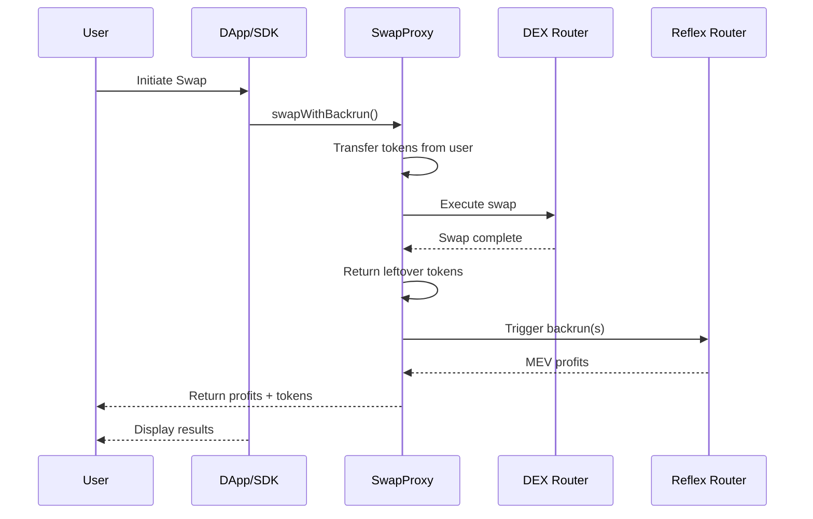

# Universal DEX Integration

Integrate Reflex MEV capture into any DEX and client applications using the TypeScript SDK and `BackrunEnabledSwapProxy` contract.

## Overview

The Universal DEX integration method enables MEV capture for:

- **Legacy DEXes** that don't support hooks/plugins
- **Frontend applications** and DApp interfaces
- **Any DEX router** without requiring code changes

This approach uses a proxy contract to wrap existing DEX routers, combined with a TypeScript SDK for easy client-side integration.

## Architecture



## Components

### 1. BackrunEnabledSwapProxy Contract

A smart contract that wraps any existing DEX router and adds MEV capture functionality.

**Key Features:**

- Works with any DEX router (Uniswap, SushiSwap, PancakeSwap, etc.)
- Atomic swap + backrun execution
- Automatic token approval management
- Returns leftover tokens and ETH to users
- Reentrancy protected

**Deployment:**
One proxy contract per target DEX router you want to support.

### 2. Reflex SDK with UniversalIntegration

A client-side library that simplifies interaction with the SwapProxy and Reflex contracts.

**Key Features:**

- Type-safe interfaces matching contract exactly
- Automatic token approval helpers
- Gas estimation
- Multi-chain support
- Built on ethers.js v6

## Quick Start

### Step 1: Deploy SwapProxy (One-time Setup)

Deploy a `BackrunEnabledSwapProxy` contract for your target DEX router:

```solidity
// Deploy via Foundry script or directly
import {BackrunEnabledSwapProxy} from "@reflex/contracts/integrations/router/BackrunEnabledSwapProxy.sol";

// Constructor takes the target DEX router address
BackrunEnabledSwapProxy proxy = new BackrunEnabledSwapProxy(
    0x7a250d5630B4cF539739dF2C5dAcb4c659F2488D  // Uniswap V2 Router
);
```

Or use the provided deployment script:

```bash
# Set environment variables
export TARGET_ROUTER_ADDRESS=0x7a250d5630B4cF539739dF2C5dAcb4c659F2488D

# Deploy
forge script script/deploy-swap-proxy/DeployBackrunEnabledSwapProxy.s.sol \
    --rpc-url <YOUR_RPC_URL> \
    --private-key <YOUR_PRIVATE_KEY> \
    --broadcast
```

### Step 2: Install SDK

```bash
npm install @reflex-mev/sdk ethers
# or
yarn add @reflex-mev/sdk ethers
```

### Step 3: Initialize UniversalIntegration

```typescript
import { UniversalIntegration } from "@reflex-mev/sdk/integrations";
import { ethers } from "ethers";

// Initialize provider and signer
const provider = new ethers.JsonRpcProvider(
  "https://mainnet.infura.io/v3/YOUR_KEY"
);
const signer = new ethers.Wallet("YOUR_PRIVATE_KEY", provider);

// Create UniversalIntegration instance
const integration = new UniversalIntegration(
  provider,
  signer,
  "0xYourSwapProxyAddress", // SwapProxy contract address
  "0xYourReflexRouterAddress" // Reflex Router address
);
```

## Using the Universal Integration API

### Basic Swap with MEV Capture

```typescript
import { UniversalIntegration } from "@reflex-mev/sdk/integrations";
import { ethers } from "ethers";

// Initialize integration
const integration = new UniversalIntegration(
  provider,
  signer,
  swapProxyAddress,
  reflexRouterAddress
);

// Encode swap calldata for target DEX router
// Example: Uniswap V2 swapExactTokensForTokens
const targetDexInterface = new ethers.Interface([
  "function swapExactTokensForTokens(uint amountIn, uint amountOutMin, address[] path, address to, uint deadline)",
]);

const swapCalldata = targetDexInterface.encodeFunctionData(
  "swapExactTokensForTokens",
  [
    ethers.parseEther("1.0"), // amountIn
    ethers.parseEther("0.95"), // amountOutMin (with slippage)
    [tokenInAddress, tokenOutAddress], // path
    userAddress, // to
    Math.floor(Date.now() / 1000) + 60 * 20, // deadline (20 min)
  ]
);

// Prepare swap metadata
const swapMetadata = {
  swapTxCallData: swapCalldata,
  tokenIn: tokenInAddress,
  amountIn: ethers.parseEther("1.0"),
  tokenOut: tokenOutAddress,
  recipient: userAddress,
};

// Prepare backrun parameters
const backrunParams = [
  {
    triggerPoolId: poolAddress, // Pool being traded on
    swapAmountIn: ethers.parseEther("1.0"), // Full swap amount
    token0In: true, // Swap direction
    recipient: userAddress,
    configId: ethers.ZeroHash, // Use default config
  },
];

// Approve tokens to SwapProxy first
await integration.approveTokens([
  {
    tokenAddress: tokenInAddress,
    amount: ethers.parseEther("1.0"),
  },
]);

// Execute swap with automatic MEV capture
const result = await integration.swapWithBackrun(
  swapMetadata,
  backrunParams,
  { gasLimit: 1500000n } // Optional: ethers Overrides
);

console.log("Transaction:", result.transactionHash);
console.log("Gas used:", result.gasUsed.toString());
console.log("Profits:", result.profits);
console.log("Profit tokens:", result.profitTokens);
```

## SwapProxy Deployment Guide

### Deploying for Your DEX

Deploy a SwapProxy for each DEX router you want to support:

```bash
# Clone the Reflex repository
git clone --recursive https://github.com/reflex-mev/reflex.git
cd reflex/core

# Set environment variables
export TARGET_ROUTER_ADDRESS=0x7a250d5630B4cF539739dF2C5dAcb4c659F2488D  # Uniswap V2 Router

# Deploy using Forge
forge script script/deploy-swap-proxy/DeployBackrunEnabledSwapProxy.s.sol \
    --rpc-url $RPC_URL \
    --private-key $PRIVATE_KEY \
    --broadcast \
    --verify
```

## Configuration and Optimization

### Gas Management

```typescript
// Use ethers Overrides for transaction options
const result = await integration.swapWithBackrun(swapMetadata, backrunParams, {
  gasLimit: 1500000n, // Recommended for MEV operations
  maxFeePerGas: ethers.parseUnits("100", "gwei"),
  maxPriorityFeePerGas: ethers.parseUnits("2", "gwei"),
});
```

### Event Monitoring

Monitor MEV capture events from the Reflex Router:

```typescript
// Event monitoring through provider
import { Interface } from "ethers";
import { REFLEX_ROUTER_ABI } from "@reflex-mev/sdk";

const routerInterface = new Interface(REFLEX_ROUTER_ABI);

// Listen for BackrunExecuted events
provider.on(
  {
    address: reflexRouterAddress,
    topics: [routerInterface.getEvent("BackrunExecuted").topicHash],
  },
  (log) => {
    const event = routerInterface.parseLog(log);

    console.log("MEV Captured!", {
      profit: ethers.formatEther(event.args.profit),
      profitToken: event.args.profitToken,
      triggerPoolId: event.args.triggerPoolId,
      recipient: event.args.recipient,
    });

    // Update UI or analytics
    analytics.track("MEV_Captured", {
      profit: event.args.profit,
      timestamp: Date.now(),
    });
  }
);
```
