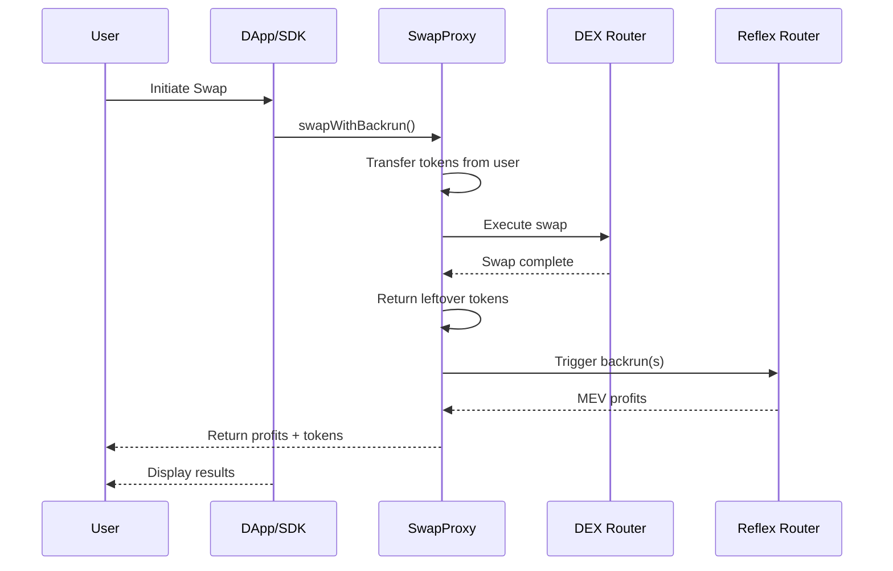

# Universal DEX Integration

Integrate Reflex MEV capture into any DEX and client applications using the TypeScript SDK and `BackrunEnabledSwapProxy` contract.

## Overview

The Universal DEX integration method enables MEV capture for:

- **Legacy DEXes** that don't support hooks/plugins
- **Frontend applications** and DApp interfaces
- **Any DEX router** without requiring code changes

This approach uses a proxy contract to wrap existing DEX routers, combined with a TypeScript SDK for easy client-side integration.

## Architecture



## Components

### 1. BackrunEnabledSwapProxy Contract

A smart contract that wraps any existing DEX router and adds MEV capture functionality.

**Key Features:**

- Works with any DEX router (Uniswap, SushiSwap, PancakeSwap, etc.)
- Atomic swap + backrun execution
- Automatic token approval management
- Returns leftover tokens and ETH to users
- Reentrancy protected

**Deployment:**
One proxy contract per target DEX router you want to support.

### 2. Reflex SDK with UniversalIntegration

A client-side library that simplifies interaction with the SwapProxy and Reflex contracts.

**Key Features:**

- Type-safe interfaces matching contract exactly
- Automatic token approval helpers
- Gas estimation
- Multi-chain support
- Built on ethers.js v6

## Quick Start

### Step 1: Deploy SwapProxy (One-time Setup)

Deploy a `BackrunEnabledSwapProxy` contract for your target DEX router:

```solidity
// Deploy via Foundry script or directly
import {BackrunEnabledSwapProxy} from "@reflex/contracts/integrations/router/BackrunEnabledSwapProxy.sol";

// Constructor takes the target DEX router address
BackrunEnabledSwapProxy proxy = new BackrunEnabledSwapProxy(
    0x7a250d5630B4cF539739dF2C5dAcb4c659F2488D  // Uniswap V2 Router
);
```

Or use the provided deployment script:

```bash
# Set environment variables
export TARGET_ROUTER_ADDRESS=0x7a250d5630B4cF539739dF2C5dAcb4c659F2488D

# Deploy
forge script script/deploy-swap-proxy/DeployBackrunEnabledSwapProxy.s.sol \
    --rpc-url <YOUR_RPC_URL> \
    --private-key <YOUR_PRIVATE_KEY> \
    --broadcast
```

### Step 2: Install SDK

```bash
npm install @reflex-mev/sdk ethers
# or
yarn add @reflex-mev/sdk ethers
```

### Step 3: Initialize UniversalIntegration

```typescript
import { UniversalIntegration } from "@reflex-mev/sdk/integrations";
import { ethers } from "ethers";

// Initialize provider and signer
const provider = new ethers.JsonRpcProvider(
  "https://mainnet.infura.io/v3/YOUR_KEY"
);
const signer = new ethers.Wallet("YOUR_PRIVATE_KEY", provider);

// Create UniversalIntegration instance
const integration = new UniversalIntegration(
  provider,
  signer,
  "0xYourSwapProxyAddress", // SwapProxy contract address
  "0xYourReflexRouterAddress" // Reflex Router address
);
```

## Using the UniversalIntegration API

### Basic Swap with MEV Capture

```typescript
import { UniversalIntegration } from "@reflex-mev/sdk/integrations";
import { ethers } from "ethers";

// Initialize integration
const integration = new UniversalIntegration(
  provider,
  signer,
  swapProxyAddress,
  reflexRouterAddress
);

// Encode swap calldata for target DEX router
// Example: Uniswap V2 swapExactTokensForTokens
const targetDexInterface = new ethers.Interface([
  "function swapExactTokensForTokens(uint amountIn, uint amountOutMin, address[] path, address to, uint deadline)",
]);

const swapCalldata = targetDexInterface.encodeFunctionData(
  "swapExactTokensForTokens",
  [
    ethers.parseEther("1.0"), // amountIn
    ethers.parseEther("0.95"), // amountOutMin (with slippage)
    [tokenInAddress, tokenOutAddress], // path
    userAddress, // to
    Math.floor(Date.now() / 1000) + 60 * 20, // deadline (20 min)
  ]
);

// Prepare swap metadata
const swapMetadata = {
  swapTxCallData: swapCalldata,
  tokenIn: tokenInAddress,
  amountIn: ethers.parseEther("1.0"),
  tokenOut: tokenOutAddress,
  recipient: userAddress,
};

// Prepare backrun parameters
const backrunParams = [
  {
    triggerPoolId: poolAddress, // Pool being traded on
    swapAmountIn: ethers.parseEther("1.0"), // Full swap amount
    token0In: true, // Swap direction
    recipient: userAddress,
    configId: ethers.ZeroHash, // Use default config
  },
];

// Approve tokens to SwapProxy first
await integration.approveTokens([
  {
    tokenAddress: tokenInAddress,
    amount: ethers.parseEther("1.0"),
  },
]);

// Execute swap with automatic MEV capture
const result = await integration.swapWithBackrun(
  swapCalldata,
  swapMetadata,
  backrunParams,
  { gasLimit: 1500000n } // Optional: ethers Overrides
);

console.log("Transaction:", result.transactionHash);
console.log("Gas used:", result.gasUsed.toString());
console.log("Profits:", result.profits);
console.log("Profit tokens:", result.profitTokens);
```

## DApp Integration

### React Hook for Universal Integration

```typescript
import { useState, useEffect, useCallback } from "react";
import { ethers } from "ethers";
import { UniversalIntegration } from "@reflex-mev/sdk/integrations";

export function useReflexSwap(
  provider,
  signer,
  swapProxyAddress,
  reflexRouterAddress
) {
  const [integration, setIntegration] = useState(null);
  const [isReady, setIsReady] = useState(false);

  useEffect(() => {
    if (provider && signer && swapProxyAddress && reflexRouterAddress) {
      const instance = new UniversalIntegration(
        provider,
        signer,
        swapProxyAddress,
        reflexRouterAddress
      );
      setIntegration(instance);
      setIsReady(true);
    }
  }, [provider, signer, swapProxyAddress, reflexRouterAddress]);

  const executeSwapWithMEV = useCallback(
    async (swapParams) => {
      if (!integration || !isReady) {
        throw new Error("UniversalIntegration not initialized");
      }

      try {
        // Encode the swap call for the target DEX
        const targetDexInterface = new ethers.Interface([
          "function swapExactTokensForTokens(uint amountIn, uint amountOutMin, address[] path, address to, uint deadline)",
        ]);

        const swapCalldata = targetDexInterface.encodeFunctionData(
          "swapExactTokensForTokens",
          [
            swapParams.amountIn,
            swapParams.amountOutMin,
            swapParams.path,
            swapParams.recipient,
            Math.floor(Date.now() / 1000) + 60 * 20, // 20 min deadline
          ]
        );

        // Prepare swap metadata
        const swapMetadata = {
          swapTxCallData: swapCalldata,
          tokenIn: swapParams.tokenIn,
          amountIn: swapParams.amountIn,
          tokenOut: swapParams.tokenOut,
          recipient: swapParams.recipient,
        };

        // Prepare backrun parameters
        const backrunParams = [
          {
            triggerPoolId: swapParams.poolAddress,
            swapAmountIn: swapParams.amountIn, // Full swap amount
            token0In: swapParams.tokenIn < swapParams.tokenOut,
            recipient: swapParams.recipient,
            configId: swapParams.configId || ethers.ZeroHash,
          },
        ];

        // Check and handle token approval
        const isApproved = await integration.isTokenApproved(
          swapParams.tokenIn,
          swapParams.amountIn
        );

        if (!isApproved) {
          await integration.approveTokens([
            {
              tokenAddress: swapParams.tokenIn,
              amount: ethers.MaxUint256, // Approve unlimited for better UX
            },
          ]);
        }

        // Execute swap with MEV capture
        const result = await integration.swapWithBackrun(
          swapCalldata,
          swapMetadata,
          backrunParams,
          { value: swapParams.ethValue || 0n }
        );

        return {
          success: true,
          transactionHash: result.transactionHash,
          gasUsed: result.gasUsed,
          profits: result.profits,
          profitTokens: result.profitTokens,
          swapReturnData: result.swapReturnData,
        };
      } catch (error) {
        console.error("Swap with MEV failed:", error);
        throw error;
      }
    },
    [integration, isReady]
  );

  return {
    integration,
    executeSwapWithMEV,
    isReady,
  };
}
```

````

### Trading Interface Component

```typescript
import React, { useState } from "react";
import { ethers } from "ethers";

export function MEVTradingInterface({
  provider,
  signer,
  swapProxyAddress,
  reflexRouterAddress
}) {
  const { integration, executeSwapWithMEV, isReady } = useReflexSwap(
    provider,
    signer,
    swapProxyAddress,
    reflexRouterAddress
  );

  const [swapAmount, setSwapAmount] = useState("");
  const [isSwapping, setIsSwapping] = useState(false);
  const [selectedTokenIn, setSelectedTokenIn] = useState(null);
  const [selectedTokenOut, setSelectedTokenOut] = useState(null);

  const handleSwap = async () => {
    if (!selectedTokenIn || !selectedTokenOut) {
      alert("Please select tokens");
      return;
    }

    setIsSwapping(true);

    try {
      const result = await executeSwapWithMEV({
        tokenIn: selectedTokenIn.address,
        tokenOut: selectedTokenOut.address,
        amountIn: ethers.parseUnits(swapAmount, selectedTokenIn.decimals),
        amountOutMin: 0n, // Set appropriate slippage
        path: [selectedTokenIn.address, selectedTokenOut.address],
        poolAddress: "0xPoolAddress", // The pool being traded on
        recipient: await signer.getAddress(),
        configId: ethers.ZeroHash, // Use default config
        ethValue: 0n // Set if swap involves ETH
      });

      if (result.success) {
        showNotification({
          type: "success",
          title: "Swap Completed!",
          message: `Transaction: ${result.transactionHash.slice(0, 10)}...`,
          details: `Gas used: ${result.gasUsed.toString()}`
        });

        // Check if MEV was captured
        if (result.profits.length > 0 && result.profits[0] > 0n) {
          showNotification({
            type: "success",
            title: "MEV Bonus Captured!",
            message: `You received an additional ${ethers.formatEther(
              result.profits[0]
            )} tokens from MEV`
          });
        }
      }
    } catch (error) {
      showNotification({
        type: "error",
        title: "Swap Failed",
        message: error.message
      });
    } finally {
      setIsSwapping(false);
    }
  };

  return (
    <div className="trading-interface">
      <h2>Swap with MEV Protection</h2>

      {/* Token Selection */}
      <div className="token-inputs">
        <input
          type="number"
          value={swapAmount}
          onChange={(e) => setSwapAmount(e.target.value)}
          placeholder="Amount to swap"
        />
        {/* Add token selectors here */}
      </div>

      {/* Swap Button */}
      <button
        onClick={handleSwap}
        disabled={!isReady || isSwapping || !swapAmount}
        className="swap-button"
      >
        {isSwapping ? "Swapping..." : "Swap with MEV Capture"}
      </button>

      {/* Info */}
      <div className="swap-info">
        <p>✅ Automatic MEV capture enabled</p>
        <p>✅ Protected from sandwich attacks</p>
        <p>✅ Profits returned to you</p>
      </div>
    </div>
  );
}
````

## Helper Functions

### Check Token Approval

```typescript
// Check if token is approved before swapping
const isApproved = await integration.isTokenApproved(tokenAddress, amount);

if (!isApproved) {
  console.log("Approval needed");
}
```

### Approve Tokens

```typescript
// Approve single token
await integration.approveTokens([
  {
    tokenAddress: USDC_ADDRESS,
    amount: ethers.MaxUint256, // Unlimited approval
  },
]);

// Approve multiple tokens
await integration.approveTokens([
  {
    tokenAddress: USDC_ADDRESS,
    amount: ethers.parseUnits("100", 6),
  },
  {
    tokenAddress: WETH_ADDRESS,
    amount: ethers.parseEther("1.0"),
  },
]);
```

### Estimate Gas

```typescript
// Estimate gas before executing
const estimatedGas = await integration.estimateGas(
  swapCalldata,
  swapMetadata,
  backrunParams
);

console.log("Estimated gas:", estimatedGas.toString());

// Use estimate with buffer
const result = await integration.swapWithBackrun(
  swapCalldata,
  swapMetadata,
  backrunParams,
  { gasLimit: estimatedGas } // Estimate already includes 20% buffer
);
```

### Get Addresses

```typescript
// Get SwapProxy address
const swapProxyAddress = integration.getSwapProxyAddress();

// Get ReflexRouter address
const routerAddress = integration.getReflexRouterAddress();

// Get target DEX router address
const targetRouterAddress = await integration.getTargetRouterAddress();
```

## SwapProxy Deployment Guide

### Deploying for Your DEX

Deploy a SwapProxy for each DEX router you want to support:

```bash
# Clone the Reflex repository
git clone --recursive https://github.com/reflex-mev/reflex.git
cd reflex/core

# Set environment variables
export TARGET_ROUTER_ADDRESS=0x7a250d5630B4cF539739dF2C5dAcb4c659F2488D  # Uniswap V2 Router

# Deploy using Forge
forge script script/deploy-swap-proxy/DeployBackrunEnabledSwapProxy.s.sol \
    --rpc-url $RPC_URL \
    --private-key $PRIVATE_KEY \
    --broadcast \
    --verify
```

### Supported DEX Routers

The SwapProxy works with any DEX router that follows standard patterns:

- **Uniswap V2** and forks (SushiSwap, PancakeSwap V2, etc.)
- **Uniswap V3** routers
- **Curve** routers
- **Balancer** vaults
- **Custom DEX routers**

Simply deploy one SwapProxy per router and point your frontend to the appropriate proxy.

## Configuration and Optimization

### Gas Management

```typescript
// Use ethers Overrides for transaction options
const result = await integration.swapWithBackrun(
  swapCalldata,
  swapMetadata,
  backrunParams,
  {
    gasLimit: 1500000n, // Recommended for MEV operations
    maxFeePerGas: ethers.parseUnits("100", "gwei"),
    maxPriorityFeePerGas: ethers.parseUnits("2", "gwei"),
  }
);
```

### Event Monitoring

Monitor MEV capture events from the Reflex Router:

```typescript
// Event monitoring through provider
import { Interface } from "ethers";
import { REFLEX_ROUTER_ABI } from "@reflex-mev/sdk";

const routerInterface = new Interface(REFLEX_ROUTER_ABI);

// Listen for BackrunExecuted events
provider.on(
  {
    address: reflexRouterAddress,
    topics: [routerInterface.getEvent("BackrunExecuted").topicHash],
  },
  (log) => {
    const event = routerInterface.parseLog(log);

    console.log("MEV Captured!", {
      profit: ethers.formatEther(event.args.profit),
      profitToken: event.args.profitToken,
      triggerPoolId: event.args.triggerPoolId,
      recipient: event.args.recipient,
    });

    // Update UI or analytics
    analytics.track("MEV_Captured", {
      profit: event.args.profit,
      timestamp: Date.now(),
    });
  }
);
```

## Best Practices

### Error Handling

```typescript
async function safeSwapWithMEV(swapParams) {
  try {
    const result = await executeSwapWithMEV(swapParams);
    return result;
  } catch (error) {
    // Check for specific error types
    if (error.code === "INSUFFICIENT_FUNDS") {
      showError("Insufficient balance for this swap");
    } else if (error.code === "USER_REJECTED") {
      showError("Transaction cancelled by user");
    } else if (error.message.includes("slippage")) {
      showError("Price moved too much. Try increasing slippage tolerance");
    } else {
      // Log unexpected errors
      console.error("Swap failed:", error);
      showError("Swap failed. Please try again");
    }
    return null;
  }
}
```

### Token Approvals

Use the built-in approval helpers:

```typescript
// Check approval first
const isApproved = await integration.isTokenApproved(tokenAddress, amount);

if (!isApproved) {
  // Approve with unlimited amount for better UX
  await integration.approveTokens([
    {
      tokenAddress,
      amount: ethers.MaxUint256,
    },
  ]);
}

// Or approve exact amount for security
await integration.approveTokens([
  {
    tokenAddress,
    amount: exactAmount,
  },
]);
```

### Security

1. **Never expose private keys** in frontend code
2. **Validate all user inputs** before sending transactions
3. **Use secure RPC endpoints** (avoid public endpoints in production)
4. **Implement rate limiting** to prevent abuse
5. **Set reasonable slippage tolerances**
6. **Check contract addresses** before interacting

## Summary

The Universal DEX integration provides:

✅ **Universal DEX Support** - Works with any DEX router without modifications  
✅ **Type-Safe SDK** - UniversalIntegration class with full TypeScript support  
✅ **Simple API** - Clean interface matching contract exactly  
✅ **Atomic Execution** - Swap + MEV capture in single transaction  
✅ **Built-in Helpers** - Token approvals, gas estimation, address getters  
✅ **Production Ready** - Tested and secure implementation

**Next Steps:**

- [View Direct Contract Access](./direct-access) - For custom protocol integration
- [View Plugin-Based Integration](./plugin-based) - For DEXes with hook support
- [Read Architecture Guide](../architecture) - Understand system design
