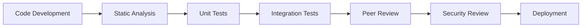

# Security

Reflex prioritizes security through multiple defensive layers designed to ensure safe and reliable MEV operations. This document outlines our comprehensive security architecture, implementation details, and best practices for secure integration.

## 🛡️ Security Architecture

### Core Security Principles

Reflex implements a multi-layered security approach that protects all participants in the MEV ecosystem:

**Failsafe Architecture** - Reflex is designed with comprehensive failsafe mechanisms that guarantee zero impact on user transactions and funds. All MEV operations use try-catch patterns to ensure that any MEV failure cannot affect underlying user transactions.

**Independent Operation** - Reflex operates completely independently from protocol and user swaps. The system has no access to user funds or protocol treasuries, only capturing MEV through legitimate arbitrage opportunities using flash loan-based swaps.

**Zero Risk to Users** - Mathematical guarantees ensure user funds cannot be accessed, locked, or affected. Users never approve tokens to Reflex, and all MEV operations are completely isolated from user transaction flow.

**Zero Trust Architecture** - No admin keys for core functionality, transparent and verifiable execution, permissionless participation, and censorship resistance.

### Multi-Layer Protection

- **Contract-level**: Reentrancy guards, access controls, and comprehensive input validation
- **Architecture-level**: Modular design with isolated components and fail-safe mechanisms
- **Economic-level**: Incentive alignment and built-in profitability guarantees
- **Operational-level**: Granular permissions and emergency procedures

## 🔒 Risk Mitigation & Protection

### 🛡️ Failsafe Architecture: Zero Impact on User Transactions

**Critical Safety Guarantee**: Reflex is designed with comprehensive failsafe mechanisms that ensure **zero impact on user transactions and funds** under all circumstances.

#### Try-Catch Protection for All MEV Operations

All Reflex MEV operations use try-catch patterns to ensure that any failure in the MEV extraction process cannot affect the underlying user transaction:

```solidity
// Example from ReflexAfterSwap integration
function reflexAfterSwap(...) internal gracefulNonReentrant returns (uint256 profit, address profitToken) {
    uint256 swapAmountIn = uint256(amount0Delta > 0 ? amount0Delta : amount1Delta);

    // Failsafe: Use try-catch to prevent router failures from breaking the main swap
    try IReflexRouter(reflexRouter).triggerBackrun(
        triggerPoolId, uint112(swapAmountIn), zeroForOne, recipient, reflexConfigId
    ) returns (uint256 backrunProfit, address backrunProfitToken) {
        return (backrunProfit, backrunProfitToken);
    } catch {
        // Router call failed, but don't revert the main transaction
        // This ensures the main swap can still complete successfully
    }

    return (0, address(0));
}
```

#### Comprehensive User Protection Guarantees

**Transaction Isolation**: MEV operations are completely isolated from user transactions:

- **Try-catch wrappers** ensure MEV failures don't propagate to user transactions
- **Graceful degradation** - if MEV extraction fails, user transaction continues normally
- **No fund access** - Reflex has zero access to user funds or token approvals
- **Independent execution** - MEV operations run independently of user swap logic

**Failure Handling**:

- **Silent failures** - MEV extraction failures are silently handled without reverting user transactions
- **Atomic operations** - Either MEV succeeds completely or fails with zero impact
- **No partial states** - No scenario where user transaction succeeds but leaves funds in limbo
- **Guaranteed execution** - User transactions always complete regardless of MEV outcome

**Fund Safety**:

- **No token approvals required** - Users never approve tokens to Reflex contracts
- **No direct fund access** - Reflex operates only on public arbitrage opportunities
- **Flash loan isolation** - All MEV operations use flash loans with automatic reversion
- **Zero user fund risk** - Impossible for Reflex to access, lock, or lose user funds

#### Real-World Failure Scenarios

**What happens when MEV extraction fails:**

1. **Router Failure**: Try-catch ensures user swap completes normally
2. **Gas Limit Exceeded**: MEV operation reverts, user transaction unaffected
3. **Insufficient Liquidity**: MEV attempt fails gracefully, user swap proceeds
4. **Oracle Issues**: MEV calculation fails, user transaction continues
5. **Smart Contract Bugs**: Any Reflex bug cannot impact user funds or transactions

**Example Integration Protection:**

```solidity
// Protocol integration with guaranteed user protection
contract YourProtocol {
    function performSwap(SwapParams memory params) external {
        // 1. Execute user swap first (guaranteed to complete)
        executeUserSwap(params);

        // 2. Attempt MEV extraction with full isolation
        try reflexIntegration.extractMEV(params) {
            // MEV succeeded - additional value captured
        } catch {
            // MEV failed - zero impact on user
            // User swap already completed successfully
        }
    }
}
```

### 1. Reentrancy Protection

All external calls are protected with a custom **GracefulReentrancyGuard** implementation:

```solidity
import "./utils/GracefulReentrancyGuard.sol";

contract ReflexRouter is IReflexRouter, GracefulReentrancyGuard, ConfigurableRevenueDistributor {
    function triggerBackrun(...) external override gracefulNonReentrant returns (uint256 profit, address profitToken) {
        // Protected execution logic with graceful failure handling
    }

    function _triggerBackrunSafe(...) external returns (uint256 profit, address profitToken) {
        require(msg.sender == address(this), "Only self-call allowed");
        // Internal call with additional self-call protection
    }
}
```

**Implementation Details:**

- **Graceful Failure**: Unlike standard reentrancy guards that revert, our implementation gracefully exits with default return values when reentrancy is detected
- **No Transaction Reversion**: Reentrancy attempts don't cause the entire transaction to fail, maintaining user transaction integrity
- **Self-Call Protection**: Internal functions include additional checks to ensure only authorized self-calls

### 2. Access Controls & Authorization

Simple but effective ownership-based access control system:

```solidity
contract ReflexRouter {
    address public owner;

    constructor() {
        owner = tx.origin; // Set deployer as owner
    }

    modifier isAdmin() {
        require(msg.sender == owner);
        _;
    }

    function setReflexQuoter(address _reflexQuoter) public isAdmin {
        reflexQuoter = _reflexQuoter;
    }

    function _onlyFundsAdmin() internal view override {
        require(msg.sender == owner, "Only admin can manage revenue configurations");
    }
}
```

**Access Control Features:**

- **Single Owner Model**: Simple ownership pattern with tx.origin as initial owner
- **Admin Functions**: Only owner can update critical parameters like quoter address
- **Revenue Management**: Owner controls all revenue distribution configurations

### 3. Fund Safety Guarantees

**Absolute User Fund Protection** - Reflex provides mathematical guarantees that user funds cannot be accessed, locked, or affected:

**Zero Fund Access Architecture**:

- **No token approvals**: Users never approve tokens to Reflex contracts
- **No direct fund access**: Reflex has zero access to user funds or protocol treasuries
- **Flash loan isolation**: Only captures public arbitrage opportunities using flash loan-based swaps
- **Independent operation**: Operates completely separately from user transaction flow
- **Try-catch protection**: All MEV operations wrapped in try-catch to prevent user transaction impact

**Mathematical Fund Safety**:

- **Impossible fund loss**: No code path exists for Reflex to access user balances
- **No approval requirement**: Users interact with protocols directly, never approving Reflex
- **Atomic MEV operations**: Either MEV succeeds completely or fails with zero user impact
- **Flash loan constraints**: All operations must be profitable or automatically revert
- **Gas-only cost**: Users only pay additional gas for MEV extraction attempts (if any)

**Failure Isolation Guarantees**:

- **Silent MEV failures**: MEV extraction failures never propagate to user transactions
- **Transaction completion**: User swaps always complete regardless of MEV outcome
- **No partial states**: Impossible to have user transaction succeed with locked funds
- **Automatic reversion**: Failed MEV operations automatically revert with zero side effects

**Real-World Protection Examples**:

```solidity
// User transaction flow - completely isolated from MEV
function userSwap(SwapParams memory params) external {
    // 1. User transaction executes normally
    token.transferFrom(user, pool, params.amountIn);
    uint256 amountOut = pool.swap(params.amountIn, params.recipient);

    // 2. MEV extraction attempt (completely isolated)
    try reflexIntegration.extractMEV(params) {
        // MEV succeeded - user gets their swap + protocol gets MEV value
    } catch {
        // MEV failed - user still got their swap normally
        // Zero impact on user transaction or funds
    }
}

// Reflex has no access to user funds at any point
// No transferFrom, no approvals, no fund manipulation possible
```

**Atomic Operations** - All MEV operations are atomic:

- Either fully successful with profit distribution, or completely reverted
- No partial state changes that could leave funds locked
- Built-in rollback mechanisms for failed operations
- Try-catch isolation ensures user transactions complete regardless of MEV outcome
  Comprehensive validation focuses on critical parameters and financial safety:

```solidity
// Revenue configuration validation (ConfigurableRevenueDistributor)
function _setShares(bytes32 configId, address[] memory _recipients, uint256[] memory _sharesBps, uint256 _dustShareBps) internal {
    require(_recipients.length == _sharesBps.length, "Recipients and shares length mismatch");
    require(_recipients.length > 0, "No recipients provided");

    uint256 totalShares = _dustShareBps;

    // Validate recipients and calculate total shares
    for (uint256 i = 0; i < _recipients.length; i++) {
        address recipient = _recipients[i];
        uint256 share = _sharesBps[i];
        require(recipient != address(0), "Invalid recipient address");
        require(share > 0, "Invalid share amount");
        totalShares += share;
    }

    require(totalShares == TOTAL_BPS, "Total shares must equal 100%");
}

// Pool validation (Algebra plugins)
require(pool != address(0), "Pool not exist");
require(pluginByPool[pool] == address(0), "Already created");

// Self-call protection (ReflexRouter)
require(msg.sender == address(this), "Only self-call allowed");

// ETH transfer validation
(bool success,) = recipient.call{value: amount}("");
require(success, "ETH transfer failed");
```

**Validation Features:**

- **Share Distribution**: Ensures revenue shares total exactly 100% (10,000 basis points)
- **Address Validation**: Checks for non-zero addresses in critical functions
- **Array Length Matching**: Validates matching lengths for parallel arrays
- **Transfer Success**: Requires successful ETH transfers with explicit error messages
- **Pool Uniqueness**: Prevents duplicate plugin creation for the same pool

## 🔍 Security Audits

### Professional Security Reviews

We take security seriously and are working with a leading audit firm to ensure the highest level of security:

| Auditor                                             | Scope         | Status | Report                                                                                                                   |
| --------------------------------------------------- | ------------- | ------ | ------------------------------------------------------------------------------------------------------------------------ |
| **[Optimum Security](https://www.optimumsec.xyz/)** | Full Protocol | Done   | [View Audit Report](https://github.com/reflex-mev/reflex/blob/main/audits/september-2025-reflex-security-assessment.pdf) |
| **[Optimum Security](https://www.optimumsec.xyz/)** | Full Protocol | Done   | [View Audit Report](https://github.com/reflex-mev/reflex/blob/main/audits/november-2025-reflex-security-assessment.pdf) |

### Internal Security Measures

While external audits are in progress, we maintain rigorous internal security practices:

- **Comprehensive Testing**: 98%+ code coverage across all contracts
- **Static Analysis**: Continuous monitoring with Slither, Mythril, and custom tools
- **Peer Review**: Minimum 3 reviewer approval for all changes
- **Formal Methods**: Critical functions verified with symbolic execution

## 🚨 Security Best Practices

### For Protocol Integrators

#### 1. Implement Failsafe Integration Patterns

**Always use try-catch for MEV operations to guarantee user transaction protection:**

```solidity
contract SecureProtocolIntegration {
    function executeSwapWithMEV(SwapParams memory params) external {
        // Step 1: Execute user transaction first (guaranteed completion)
        uint256 amountOut = _executeUserSwap(params);

        // Step 2: Attempt MEV extraction with full isolation
        try reflexRouter.triggerBackrun(
            params.poolId,
            params.amountIn,
            params.zeroForOne,
            params.recipient,
            configId
        ) returns (uint256 profit, address profitToken) {
            // MEV succeeded - emit event for tracking
            emit MEVExtracted(profit, profitToken);
        } catch Error(string memory reason) {
            // MEV failed with reason - log but don't revert user transaction
            emit MEVFailed(reason);
        } catch (bytes memory lowLevelData) {
            // MEV failed with low-level error - log but don't revert user transaction
            emit MEVFailedLowLevel(lowLevelData);
        }

        // User transaction completed regardless of MEV outcome
        emit SwapCompleted(params.recipient, amountOut);
    }

    function _executeUserSwap(SwapParams memory params) internal returns (uint256) {
        // User swap logic - completely independent of MEV
        // This must complete successfully regardless of MEV outcome
        return pool.swap(params.amountIn, params.minAmountOut, params.recipient);
    }
}
```

**Key Integration Principles:**

- **Execute user logic first**: Ensure user transactions complete before MEV attempts
- **Use comprehensive try-catch**: Handle both string errors and low-level failures
- **Never revert on MEV failure**: User transactions must complete regardless of MEV outcome
- **Log MEV failures**: Track MEV performance without affecting user experience
- **Validate user protection**: Test that MEV failures don't impact user transactions

#### 2. Implement Owner-Based Access Control

```solidity
// Use simple ownership pattern like ReflexRouter
contract YourProtocol {
    address public owner;

    constructor() {
        owner = tx.origin; // Or msg.sender depending on deployment method
    }

    modifier onlyOwner() {
        require(msg.sender == owner, "Only owner");
        _;
    }

    function updateCriticalParameter(uint256 newValue) external onlyOwner {
        // Update parameter
    }
}
```

#### 3. Set Up Comprehensive Monitoring

Monitor these critical metrics based on actual contract events and behaviors:

```javascript
// Monitoring checklist aligned with actual implementation
const monitoringMetrics = {
  profitDistribution: {
    // Monitor SharesUpdated events from ConfigurableRevenueDistributor
    event: "SharesUpdated(bytes32,address[],uint256[],uint256)",
    expectedRange: [0.01, 10], // ETH
    alertThreshold: 50, // ETH
    timeWindow: "1h",
  },
  failureRate: {
    // Monitor failed triggerBackrun calls (graceful failures)
    maxFailureRate: 0.05, // 5%
    consecutiveFailures: 3,
    timeWindow: "15m",
  },
  adminActions: {
    // Monitor isAdmin protected functions
    functions: ["setReflexQuoter", "withdrawToken", "withdrawEth"],
    alertOnAny: true,
    requireApproval: true,
  },
  ownershipChanges: {
    // Monitor any owner changes
    alertOnAny: true,
    immediateAlert: true,
  },
};
```

#### 4. Emergency Response Procedures

```solidity
// Implement graceful failure handling like ReflexRouter
contract EmergencyManagement {
    address public owner;
    bool public paused = false;

    modifier whenNotPaused() {
        if (paused) return; // Graceful exit instead of revert
        _;
    }

    modifier onlyOwner() {
        require(msg.sender == owner, "Only owner");
        _;
    }

    function emergencyPause() external onlyOwner {
        paused = true;
        emit EmergencyPause(block.timestamp);
    }

    function emergencyUnpause() external onlyOwner {
        paused = false;
        emit EmergencyUnpause(block.timestamp);
    }

    // Emergency withdrawal functions like ReflexRouter
    function withdrawToken(address token, uint256 amount, address _to) public onlyOwner {
        IERC20(token).transfer(_to, amount);
    }

    function withdrawEth(uint256 amount, address payable _to) public onlyOwner {
        _to.transfer(amount);
    }
}
```

### 🛡️ User Fund Safety Guarantee

**Important**: Reflex provides absolute guarantees that your funds and transactions are completely safe:

- **Zero fund access**: Reflex never touches your tokens or requires approvals
- **Transaction isolation**: MEV operations cannot affect your swaps or transactions
- **Failsafe design**: All MEV attempts use try-catch to prevent any impact on your actions
- **No additional risk**: Using Reflex-enabled protocols carries zero additional risk to your funds
- **Guaranteed execution**: Your transactions always complete successfully regardless of MEV outcome

**You can use Reflex-enabled protocols with complete confidence** - there is no scenario where Reflex can harm your funds or transactions.

```javascript
// Test suite for Reflex integration based on actual contract behavior
describe("Reflex Integration Security", () => {
  it("should handle graceful reentrancy protection", async () => {
    // Test that reentrancy attempts gracefully exit instead of reverting
    const result = await reflexRouter.triggerBackrun(
      poolId,
      amount,
      true,
      recipient,
      configId
    );
    expect(result).to.not.be.reverted; // Should gracefully handle reentrancy
  });

  it("should enforce owner-only access", async () => {
    const nonOwner = accounts[1];
    await expect(
      reflexRouter.connect(nonOwner).setReflexQuoter(newQuoter)
    ).to.be.revertedWith(""); // Simple require without message in actual code
  });

  it("should validate revenue configuration parameters", async () => {
    const invalidShares = {
      recipients: [addr1, addr2],
      sharesBps: [5000, 6000], // Totals 11000 with dust
      dustShareBps: 0,
    };
    await expect(
      revenueDistributor.updateShares(
        configId,
        invalidShares.recipients,
        invalidShares.sharesBps,
        invalidShares.dustShareBps
      )
    ).to.be.revertedWith("Total shares must equal 100%");
  });

  it("should require valid recipient addresses", async () => {
    const invalidConfig = {
      recipients: [ethers.constants.AddressZero],
      sharesBps: [10000],
      dustShareBps: 0,
    };
    await expect(
      revenueDistributor.updateShares(
        configId,
        invalidConfig.recipients,
        invalidConfig.sharesBps,
        invalidConfig.dustShareBps
      )
    ).to.be.revertedWith("Invalid recipient address");
  });
});
```

## 🏗️ Secure Development & Operations

### Development Security Standards

**Code Quality Requirements:**

- **Test Coverage**: 98%+ code coverage requirement across all contracts
- **Static Analysis**: Continuous integration with Slither, Mythril, and custom security tools
- **Peer Review**: Minimum 3 reviewer approval for all code changes
- **Formal Verification**: Critical functions verified with symbolic execution tools

**Development Process:**



### Continuous Security Monitoring

**Real-time Detection Systems:**

- Unusual MEV profit patterns or distribution anomalies
- Failed transaction rate monitoring and alerting
- Gas usage spike detection and circuit breakers
- External oracle failure detection and fallback mechanisms

**Automated Response Systems:**

- Circuit breakers for anomaly protection
- Rate limiting for excessive activity
- Automatic pause mechanisms for critical issues
- Emergency upgrade procedures

### Operational Security

**Infrastructure Security:**

- Multi-signature wallets for administrative functions
- Hardware security modules for key management
- Redundant monitoring systems across multiple providers
- 24/7 incident response team availability

**Emergency Procedures:**

1. **Detection**: Automated monitoring or community reports
2. **Assessment**: Security team evaluates severity within 30 minutes
3. **Containment**: Circuit breakers activated if needed
4. **Investigation**: Root cause analysis and impact assessment
5. **Resolution**: Fix deployment and comprehensive verification
6. **Communication**: Public disclosure and ecosystem updates

## 🚨 Emergency Response

### Automated Circuit Breakers

Reflex includes built-in protection mechanisms that automatically pause operations when:

- **Profit Anomalies**: Unusual profit patterns detected (>10x normal distribution)
- **Gas Cost Spikes**: Gas costs exceed 3x expected thresholds
- **Failure Rate**: Failed transaction rate exceeds 20% over 15-minute window
- **Oracle Issues**: External price oracle failures or significant deviations

### Manual Emergency Procedures

**Emergency Pause Authority:**

- Protocol integrators can pause their specific integration
- Reflex team can pause system-wide operations if needed
- Multi-signature requirements for all emergency actions

**Response Timeline:**

- **Immediate** (0-15 minutes): Automated systems respond to anomalies
- **Short-term** (15-60 minutes): Security team assessment and manual intervention
- **Medium-term** (1-24 hours): Root cause analysis and fix development
- **Long-term** (24+ hours): Fix deployment, testing, and ecosystem communication

### Emergency Contacts & Reporting

**Primary Security Contacts:**

- **Security Team**: security@reflexmev.io
- **Emergency Response**: emergency@reflexmev.io
- **Twitter/X**: [@ReflexMEV](https://x.com/ReflexMEV)
