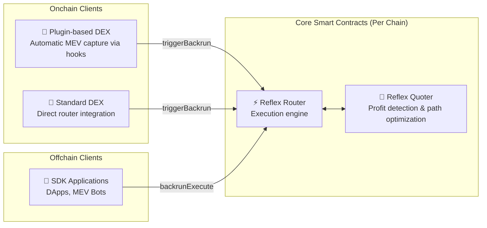
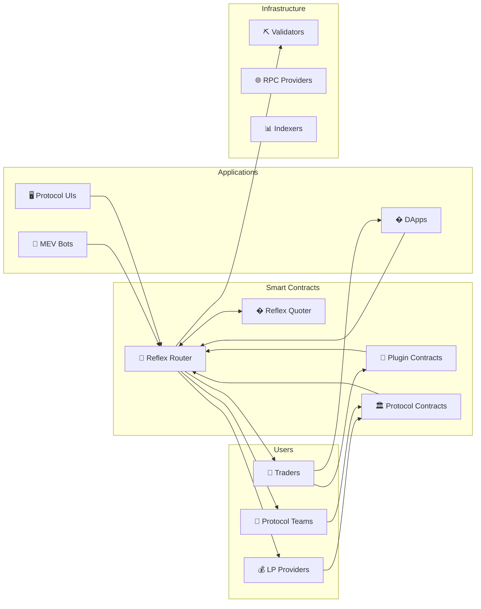
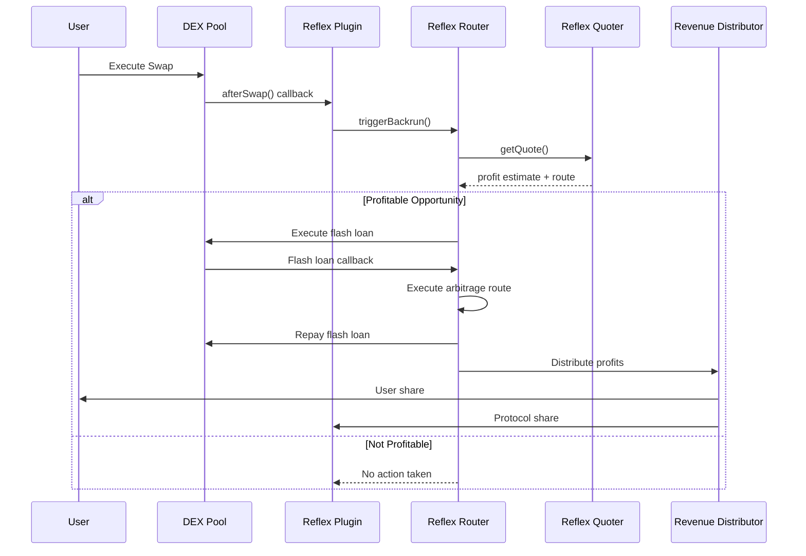
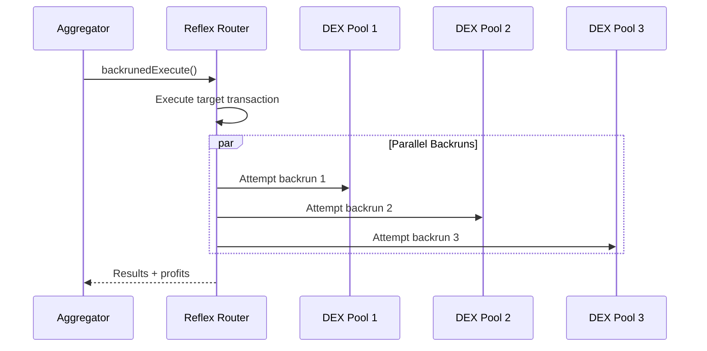
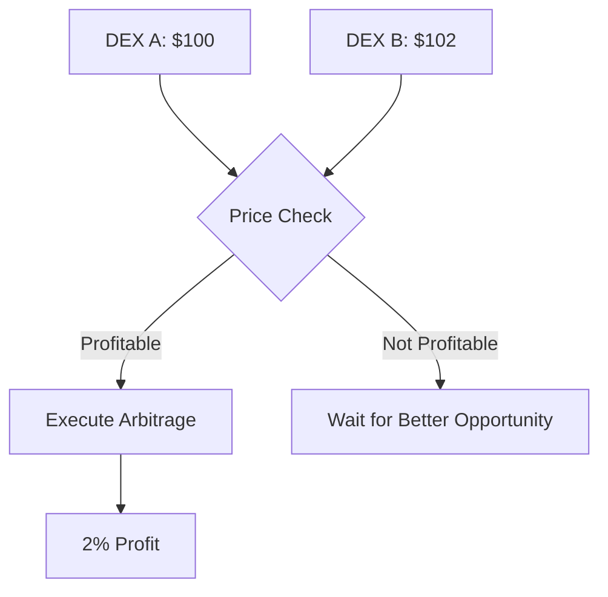
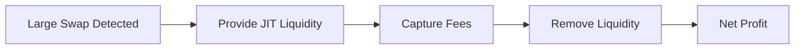
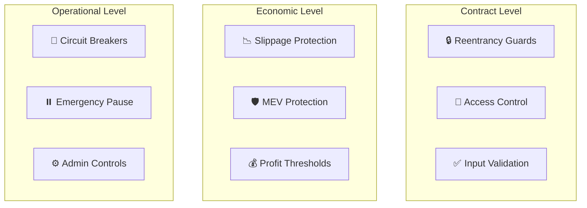
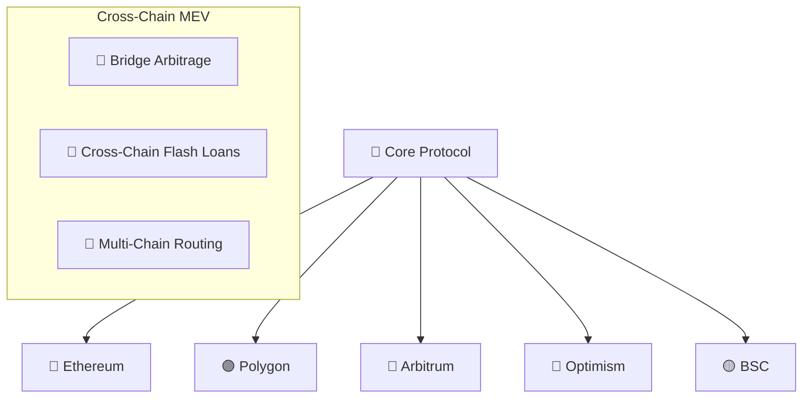

# Architecture Overview

Understanding Reflex Protocol's architecture is key to building effective MEV capture strategies. This document provides a comprehensive overview of the system design, components, and data flow.

## 🏗️ High-Level Architecture

Reflex Protocol operates through a simple yet powerful architecture consisting of core smart contracts deployed per chain and multiple integration pathways for different entities. The system is designed to capture MEV opportunities and distribute profits fairly across the ecosystem.

### Core Components Per Chain

Each blockchain network has two core Reflex contracts:



### Router Entry Points

The **Reflex Router** has two main entry points for MEV capture:

#### 1. `triggerBackrun()` - Automatic MEV Capture

- **Called by**: Plugin contracts or protocol contracts
- **When**: After user swaps that create arbitrage opportunities
- **Purpose**: Capture MEV from detected price discrepancies
- **Returns**: Profit amount and token to the specified recipient

#### 2. `backrunExecute()` - Protected Transaction Execution

- **Called by**: Client applications via SDK or custom integrations
- **When**: Before executing a transaction that might be front-run
- **Purpose**: Execute transaction and immediately capture any MEV opportunities
- **Returns**: Transaction results plus captured MEV profits

### Entity Roles & Interactions



## 🧩 Core Components

### 1. Reflex Router

The central execution engine that coordinates all MEV capture activities. **One instance deployed per blockchain.**

**Key Responsibilities:**

- Executes MEV capture through two main entry points
- Coordinates with the quoter for profitability analysis
- Manages flash loan execution for arbitrage trades
- Handles revenue distribution to configured recipients
- Maintains security through reentrancy protection

**Main Entry Points:**

```solidity
// Automatic MEV capture (called by plugins/protocols)
function triggerBackrun(
    bytes32 triggerPoolId,
    uint112 swapAmountIn,
    bool token0In,
    address recipient,
    bytes32 configId
) external returns (uint256 profit, address profitToken);

// Protected transaction execution (called by clients)
function backrunExecute(
    address target,
    bytes calldata data,
    bytes32 configId
) external payable returns (uint256 profit, address profitToken);
```

### 2. Reflex Quoter

The pricing and analysis engine that determines MEV opportunities. **One instance deployed per blockchain.**

**Key Responsibilities:**

- Analyzes price differences across DEX pools in real-time
- Calculates optimal arbitrage routes and execution paths
- Estimates gas costs and net profitability
- Provides execution parameters to the router
- Caches route data for efficiency

**Analysis Workflow:**


### 3. Integration Contracts

Reflex integrates with existing protocols through various contract patterns:

#### Plugin Contracts

Lightweight contracts that integrate with DEX protocols using hooks or callbacks:

**Key Responsibilities:**

- Monitor swap events in specific DEX pools
- Automatically trigger MEV capture via `triggerBackrun()`
- Handle protocol-specific callback mechanisms
- Implement threshold and configuration logic

**Plugin Types:**

- **UniswapV2Plugin**: For AMMs with swap callbacks
- **UniswapV3Plugin**: For concentrated liquidity pools
- **CurvePlugin**: For stable coin pools
- **CustomPlugin**: For proprietary AMM protocols

#### Direct Protocol Integration

Protocols can integrate Reflex directly into their core contracts:

**Key Responsibilities:**

- Call router methods directly from protocol logic
- Manage custom revenue sharing configurations
- Implement protocol-specific MEV capture strategies
- Handle both `triggerBackrun()` and `backrunExecute()` patterns

### 4. Client Applications

Applications that interact with Reflex through the TypeScript SDK:

**Application Types:**

- **DApp Frontends**: Protect users from MEV while capturing profits
- **MEV Bots**: Custom strategies for professional MEV extraction
- **Protocol UIs**: Integrated MEV capture in protocol interfaces
- **Trading Tools**: Enhanced trading with automatic MEV protection

**SDK Capabilities:**

- Event monitoring and opportunity detection
- Transaction simulation and profit estimation
- Automated MEV capture execution
- Multi-chain deployment management

## 🔄 Transaction Flow

### Standard Backrun Flow



### Batched Execution Flow



## 💡 MEV Capture Strategies

### 1. Sandwich Attack Prevention

Transform harmful sandwich attacks into beneficial backruns:


### 2. Arbitrage Opportunities

Capture cross-DEX price differences:



### 3. Just-In-Time Liquidity

Provide liquidity exactly when needed:



## 🔧 Gas Optimization

### Flash Loan Efficiency

Reflex minimizes gas usage through:

- **Single Transaction**: All operations in one atomic transaction
- **Optimal Routing**: Shortest path through DEX pools
- **Batch Operations**: Multiple swaps in single call
- **Callback Optimization**: Efficient callback handling

### Gas Usage Breakdown

```
Base Transaction:     21,000 gas
Flash Loan Setup:     30,000 gas
Swap Execution:       80,000 gas per hop
Profit Distribution:  25,000 gas per recipient
Event Emission:        5,000 gas
-----------------------------------------
Typical Total:       ~160,000 gas
```

## 🛡️ Security Architecture

### Multi-Layer Security



### Risk Mitigation

1. **Flash Loan Attacks**: Protected by reentrancy guards and callback validation
2. **Front-running**: Beneficially redirected to users through MEV capture
3. **Oracle Manipulation**: Multiple price sources and sanity checks
4. **Smart Contract Bugs**: Comprehensive testing and formal verification

## 📊 Performance Characteristics

### Throughput

- **Transaction Processing**: 1000+ TPS capability
- **Event Monitoring**: Real-time block processing
- **Route Calculation**: Sub-second quote generation
- **Gas Efficiency**: 40-60% less gas than competing solutions

### Latency

- **Block Detection**: `<100ms`
- **Opportunity Analysis**: `<200ms`
- **Transaction Submission**: `<300ms`
- **Total MEV Capture Time**: `<600ms`

### Scalability

- **Horizontal Scaling**: Multiple quoter instances
- **Load Balancing**: Distributed across regions
- **Caching**: Aggressive route and price caching
- **Batch Processing**: Multiple opportunities per transaction

## 🌐 Multi-Chain Architecture

### Chain-Agnostic Design

Reflex is designed to work across multiple blockchain networks:



### Network-Specific Optimizations

- **Ethereum**: Focus on high-value arbitrage
- **L2 Networks**: Low-cost, high-frequency strategies
- **Side Chains**: Specialized DeFi protocol integration
- **Cross-Chain**: Bridge arbitrage opportunities

## 🔮 Future Enhancements

### Planned Features

1. **AI-Powered Quoter**: Machine learning for opportunity prediction
2. **Cross-Chain MEV**: Arbitrage across different networks
3. **Privacy Features**: Zero-knowledge MEV strategies
4. **Governance Integration**: Community-driven parameter updates

### Research Areas

- **Intent-based Architecture**: User intent fulfillment optimization
- **Collaborative MEV**: Multi-party MEV sharing protocols
- **Sustainable MEV**: Long-term ecosystem health focus
- **Regulatory Compliance**: Privacy-preserving compliance tools

---

This architecture enables Reflex to provide efficient, secure, and fair MEV capture that benefits all participants in the DeFi ecosystem. The modular design allows for easy integration with existing protocols while maintaining the flexibility to adapt to future innovations.

For implementation details, see our [Integration Guide](../integration/overview) and [API Reference](../api/smart-contracts).
