# Architecture Overview

Understanding Reflex Protocol's architecture is key to building effective MEV capture strategies. This document provides a comprehensive overview of the system design, components, and data flow.

## 🏗️ High-Level Architecture

Reflex Protocol consists of several interconnected components that work together to capture and distribute MEV:

```mermaid
graph TB
    User[👤 User Transaction] --> DEX[🏪 DEX Pool]
    DEX --> Plugin[🔌 Reflex Plugin]
    Plugin --> Router[🎯 Reflex Router]
    Router --> Quoter[💡 Reflex Quoter]
    Quoter --> |Price Analysis| Router
    Router --> Executor[⚡ Swap Executor]
    Executor --> |Flash Loan| DEX
    Executor --> Distributor[💰 Revenue Distributor]
    Distributor --> Protocol[🏛️ Protocol Share]
    Distributor --> UserReward[🎁 User Rewards]
    Distributor --> Validator[⛏️ Validator Tips]

    subgraph "Off-Chain"
        Monitor[👁️ Event Monitor]
        Analytics[📊 Analytics Engine]
    end

    Plugin --> Monitor
    Monitor --> Analytics
```



## 🧩 Core Components

### 1. Reflex Router

The central orchestrator that coordinates all MEV capture activities.

**Key Responsibilities:**

- Receives backrun triggers from plugins
- Coordinates with the quoter for profitability analysis
- Executes arbitrage trades through flash loans
- Manages revenue distribution

**Core Functions:**

```solidity
function triggerBackrun(
    bytes32 triggerPoolId,
    uint112 swapAmountIn,
    bool token0In,
    address recipient,
    bytes32 configId
) external returns (uint256 profit, address profitToken);
```

### 2. Reflex Quoter

The pricing engine that determines arbitrage opportunities and optimal execution paths.

**Key Responsibilities:**

- Analyzes price differences across DEX pools
- Calculates optimal arbitrage routes
- Estimates gas costs and profitability
- Provides execution parameters

**Analysis Process:**

```mermaid
graph LR
    Input[🎯 Trigger Pool] --> Analysis[📊 Price Analysis]
    Analysis --> Routes[🛣️ Route Discovery]
    Routes --> Profitability[💰 Profit Calculation]
    Profitability --> Execution[⚡ Execution Plan]
```



### 3. DEX Plugins

Lightweight contracts that integrate with existing DEX protocols.

**Key Responsibilities:**

- Monitor swap events in real-time
- Trigger backrun opportunities
- Implement protocol-specific logic
- Handle callback mechanisms

**Plugin Types:**

- **UniswapV2Plugin**: For UniswapV2-style AMMs
- **UniswapV3Plugin**: For concentrated liquidity pools
- **CurvePlugin**: For stable coin pools
- **CustomPlugin**: For proprietary AMMs

### 4. Revenue Distributor

Manages the fair distribution of captured MEV across stakeholders.

**Key Responsibilities:**

- Configurable profit sharing
- Multi-recipient distributions
- Dust handling
- Event emission for transparency

**Distribution Models:**

- **Fixed Percentage**: Static allocation percentages
- **Dynamic Sharing**: Allocation based on contribution
- **Tiered System**: Different rates for different users
- **Time-based**: Rewards that change over time

## 🔄 Transaction Flow

### Standard Backrun Flow


### Batched Execution Flow


## 💡 MEV Capture Strategies

### 1. Sandwich Attack Prevention

Transform harmful sandwich attacks into beneficial backruns:

```mermaid
graph LR
    BadMEV[😈 Sandwich Attack] --> Detection[🔍 Detection]
    Detection --> Mitigation[🛡️ Mitigation]
    Mitigation --> GoodMEV[😇 User Backrun]
    GoodMEV --> Reward[🎁 User Rewards]
```



### 2. Arbitrage Opportunities

Capture cross-DEX price differences:


### 3. Just-In-Time Liquidity

Provide liquidity exactly when needed:


## 🔧 Gas Optimization

### Flash Loan Efficiency

Reflex minimizes gas usage through:

- **Single Transaction**: All operations in one atomic transaction
- **Optimal Routing**: Shortest path through DEX pools
- **Batch Operations**: Multiple swaps in single call
- **Callback Optimization**: Efficient callback handling

### Gas Usage Breakdown

```
Base Transaction:     21,000 gas
Flash Loan Setup:     30,000 gas
Swap Execution:       80,000 gas per hop
Profit Distribution:  25,000 gas per recipient
Event Emission:        5,000 gas
-----------------------------------------
Typical Total:       ~160,000 gas
```

## 🛡️ Security Architecture

### Multi-Layer Security

```mermaid
graph TB
    subgraph "Contract Level"
        Reentrancy[🔒 Reentrancy Guards]
        AccessControl[👮 Access Control]
        InputValidation[✅ Input Validation]
    end

    subgraph "Economic Level"
        SlippageProtection[📉 Slippage Protection]
        MEVProtection[🛡️ MEV Protection]
        ProfitThresholds[💰 Profit Thresholds]
    end

    subgraph "Operational Level"
        CircuitBreakers[🚨 Circuit Breakers]
        EmergencyPause[⏸️ Emergency Pause]
        AdminControls[⚙️ Admin Controls]
    end
```



### Risk Mitigation

1. **Flash Loan Attacks**: Protected by reentrancy guards and callback validation
2. **Front-running**: Beneficially redirected to users through MEV capture
3. **Oracle Manipulation**: Multiple price sources and sanity checks
4. **Smart Contract Bugs**: Comprehensive testing and formal verification

## 📊 Performance Characteristics

### Throughput

- **Transaction Processing**: 1000+ TPS capability
- **Event Monitoring**: Real-time block processing
- **Route Calculation**: Sub-second quote generation
- **Gas Efficiency**: 40-60% less gas than competing solutions

### Latency

- **Block Detection**: `<100ms`
- **Opportunity Analysis**: `<200ms`
- **Transaction Submission**: `<300ms`
- **Total MEV Capture Time**: `<600ms`

### Scalability

- **Horizontal Scaling**: Multiple quoter instances
- **Load Balancing**: Distributed across regions
- **Caching**: Aggressive route and price caching
- **Batch Processing**: Multiple opportunities per transaction

## 🌐 Multi-Chain Architecture

### Chain-Agnostic Design

Reflex is designed to work across multiple blockchain networks:

```mermaid
graph TB
    Core[🧠 Core Protocol] --> Ethereum[🔷 Ethereum]
    Core --> Polygon[🟣 Polygon]
    Core --> Arbitrum[🔵 Arbitrum]
    Core --> Optimism[🔴 Optimism]
    Core --> BSC[🟡 BSC]

    subgraph "Cross-Chain MEV"
        Bridge1[🌉 Bridge Arbitrage]
        Bridge2[🌉 Cross-Chain Flash Loans]
        Bridge3[🌉 Multi-Chain Routing]
    end
```



### Network-Specific Optimizations

- **Ethereum**: Focus on high-value arbitrage
- **L2 Networks**: Low-cost, high-frequency strategies
- **Side Chains**: Specialized DeFi protocol integration
- **Cross-Chain**: Bridge arbitrage opportunities

## 🔮 Future Enhancements

### Planned Features

1. **AI-Powered Quoter**: Machine learning for opportunity prediction
2. **Cross-Chain MEV**: Arbitrage across different networks
3. **Privacy Features**: Zero-knowledge MEV strategies
4. **Governance Integration**: Community-driven parameter updates

### Research Areas

- **Intent-based Architecture**: User intent fulfillment optimization
- **Collaborative MEV**: Multi-party MEV sharing protocols
- **Sustainable MEV**: Long-term ecosystem health focus
- **Regulatory Compliance**: Privacy-preserving compliance tools

---

This architecture enables Reflex to provide efficient, secure, and fair MEV capture that benefits all participants in the DeFi ecosystem. The modular design allows for easy integration with existing protocols while maintaining the flexibility to adapt to future innovations.

For implementation details, see our [Integration Guide](../integration/overview) and [API Reference](../api/smart-contracts).
