# Architecture Overview

Understanding Reflex Protocol's architecture is key to building effective MEV capture strategies. This document provides a comprehensive overview of the system design, components, and data flow.

## 🏗️ High-Level Architecture

Reflex Protocol operates through a simple yet powerful architecture consisting of core smart contracts deployed per chain and multiple integration pathways for different entities. The system is designed to capture MEV opportunities and distribute profits fairly across the ecosystem.

### Core Components Per Chain

Each blockchain network has two core Reflex contracts:

```mermaid
graph LR
    subgraph "Users"
        UserGroup[👤 Users<br/>Traders & DeFi Users]
    end

    subgraph "Core Smart Contracts (Per Chain)"
        Router[⚡ Reflex Router<br/>Execution engine]
        Quoter[🧠 Reflex Quoter<br/>Profit detection & path optimization]
        Router <--> Quoter
    end

    subgraph "Onchain Clients"
        PluginDEX[🔌 Plugin-based DEX<br/>Automatic MEV capture via hooks]
        RegularDEX[🏪 Standard DEX<br/>Direct router integration]
    end

    subgraph "Offchain Clients"
        SDKApps[📱 SDK Applications<br/>DApps, MEV Bots]
    end

    %% User transactions trigger MEV opportunities
    UserGroup -->|Trade/Swap| PluginDEX
    UserGroup -->|Trade/Swap| RegularDEX
    UserGroup -->|Interact| SDKApps

    %% Client connections to core contracts
    PluginDEX -->|triggerBackrun| Router
    RegularDEX -->|triggerBackrun| Router
    SDKApps -->|backrunExecute| Router
```

**Reflex Router** - The central execution engine that coordinates all MEV capture activities. Handles both automatic MEV capture through `triggerBackrun()` and protected transaction execution through `backrunExecute()`.

**Reflex Quoter** - The analysis engine that detects MEV opportunities by analyzing price differences across DEX pools, calculating optimal arbitrage routes, and estimating profitability.

**Onchain Clients** - Smart contracts that integrate directly with Reflex:

- Plugin-based DEXes use hooks to automatically capture MEV after user swaps
- Standard DEXes integrate the router directly into their core contracts

**Offchain Clients** - Applications that use the Reflex SDK:

- DApps protect users from MEV while capturing profits
- MEV Bots implement custom strategies for professional MEV extraction

## 🧩 Core Components

### 1. Reflex Router

The central execution engine that coordinates all MEV capture activities. **One instance deployed per blockchain.**

**Key Responsibilities:**

- Executes MEV capture through two main entry points
- Coordinates with the quoter for profitability analysis
- Manages flash loan execution for arbitrage trades
- Handles revenue distribution to configured recipients
- Maintains security through reentrancy protection

### 2. Reflex Quoter

The pricing and analysis engine that determines MEV opportunities. **One instance deployed per blockchain.**

**Key Responsibilities:**

- Analyzes price differences across DEX pools in real-time
- Calculates optimal arbitrage routes and execution paths
- Estimates gas costs and net profitability
- Provides execution parameters to the router
- Caches route data for efficiency

**Analysis Workflow:**

```mermaid
graph LR
    TriggerPool[🎯 Trigger] --> PriceCheck[📊 Analysis]
    PriceCheck --> RouteFind[🛣️ Route Discovery]
    RouteFind --> GasEst[⛽ Gas Estimation]
    GasEst --> ProfitCalc[💰 Profit Calculation]
    ProfitCalc --> ExecutionPlan[⚡ Execution Parameters]
```

### 3. Integration Types

Reflex supports three main integration patterns to accommodate different use cases:

**Plugin-based Integration** - Lightweight contracts that use DEX hooks or callbacks to automatically trigger MEV capture after user swaps. Ideal for existing DEX protocols that want to add MEV capture without modifying core contracts.

**Direct Integration** - DEX protocols integrate Reflex router calls directly into their core smart contracts. Provides maximum control and customization for revenue sharing and MEV strategies.

**SDK Integration** - Applications use the TypeScript SDK to interact with Reflex. Perfect for DApp frontends, MEV bots, trading tools, and any offchain application that wants to protect users or implement custom MEV strategies.

#### SDK Application Types:

- **DApp Frontends**: Protect users from MEV while capturing profits
- **MEV Bots**: Custom strategies for professional MEV extraction
- **Protocol UIs**: Integrated MEV capture in protocol interfaces
- **Trading Tools**: Enhanced trading with automatic MEV protection

#### SDK Capabilities:

- Event monitoring and opportunity detection
- Transaction simulation and profit estimation
- Automated MEV capture execution
- Multi-chain deployment management

## 🔄 Transaction Flow

### Standard Backrun Flow

## 💡 MEV Capture Strategies

### 1. Sandwich Attack Prevention

Transform harmful sandwich attacks into beneficial backruns:

```mermaid
graph LR
    BadMEV[😈 Sandwich Attack] --> Detection[🔍 Detection]
    Detection --> Mitigation[🛡️ Mitigation]
    Mitigation --> GoodMEV[😇 User Backrun]
    GoodMEV --> Reward[🎁 User Rewards]
```

### 2. Arbitrage Opportunities

Capture cross-DEX price differences:

### 3. Just-In-Time Liquidity

Provide liquidity exactly when needed:

## 🛡️ Security Architecture

### Multi-Layer Security

```mermaid
graph TB
    subgraph "Contract Level"
        Reentrancy[🔒 Reentrancy Guards]
        AccessControl[👮 Access Control]
        InputValidation[✅ Input Validation]
    end

    subgraph "Economic Level"
        SlippageProtection[📉 Slippage Protection]
        MEVProtection[🛡️ MEV Protection]
        ProfitThresholds[💰 Profit Thresholds]
    end

    subgraph "Operational Level"
        CircuitBreakers[🚨 Circuit Breakers]
        EmergencyPause[⏸️ Emergency Pause]
        AdminControls[⚙️ Admin Controls]
    end
```

### Risk Mitigation

1. **Flash Loan Attacks**: Protected by reentrancy guards and callback validation
2. **Front-running**: Beneficially redirected to users through MEV capture
3. **Oracle Manipulation**: Multiple price sources and sanity checks
4. **Smart Contract Bugs**: Comprehensive testing and formal verification

## 📊 Performance Characteristics

### Throughput

- **Transaction Processing**: 1000+ TPS capability
- **Event Monitoring**: Real-time block processing
- **Route Calculation**: Sub-second quote generation
- **Gas Efficiency**: 40-60% less gas than competing solutions

### Latency

- **Block Detection**: `<100ms`
- **Opportunity Analysis**: `<200ms`
- **Transaction Submission**: `<300ms`
- **Total MEV Capture Time**: `<600ms`

### Scalability

- **Horizontal Scaling**: Multiple quoter instances
- **Load Balancing**: Distributed across regions
- **Caching**: Aggressive route and price caching
- **Batch Processing**: Multiple opportunities per transaction

## 🌐 Multi-Chain Architecture

### Chain-Agnostic Design

Reflex is designed to work across multiple blockchain networks:

```mermaid
graph TB
    Core[🧠 Core Protocol] --> Ethereum[🔷 Ethereum]
    Core --> Polygon[🟣 Polygon]
    Core --> Arbitrum[🔵 Arbitrum]
    Core --> Optimism[🔴 Optimism]
    Core --> BSC[🟡 BSC]

    subgraph "Cross-Chain MEV"
        Bridge1[🌉 Bridge Arbitrage]
        Bridge2[🌉 Cross-Chain Flash Loans]
        Bridge3[🌉 Multi-Chain Routing]
    end
```

### Network-Specific Optimizations

- **Ethereum**: Focus on high-value arbitrage
- **L2 Networks**: Low-cost, high-frequency strategies
- **Side Chains**: Specialized DeFi protocol integration
- **Cross-Chain**: Bridge arbitrage opportunities

## 🔮 Future Enhancements

### Planned Features

1. **AI-Powered Quoter**: Machine learning for opportunity prediction
2. **Cross-Chain MEV**: Arbitrage across different networks
3. **Privacy Features**: Zero-knowledge MEV strategies
4. **Governance Integration**: Community-driven parameter updates

### Research Areas

- **Intent-based Architecture**: User intent fulfillment optimization
- **Collaborative MEV**: Multi-party MEV sharing protocols
- **Sustainable MEV**: Long-term ecosystem health focus
- **Regulatory Compliance**: Privacy-preserving compliance tools

---

This architecture enables Reflex to provide efficient, secure, and fair MEV capture that benefits all participants in the DeFi ecosystem. The modular design allows for easy integration with existing protocols while maintaining the flexibility to adapt to future innovations.

For implementation details, see our [Integration Guide](../integration/overview) and [API Reference](../api/smart-contracts).
