# Integration Overview

Learn how to integrate Reflex Protocol into your DeFi protocol to capture and distribute MEV fairly among your users.

## 🎯 Integration Strategies

Reflex offers multiple integration approaches depending on your protocol's architecture and requirements:

### 1. Plugin Integration (Recommended)

Deploy a lightweight plugin contract that automatically captures MEV from swaps:

```mermaid
graph LR
    User[👤 User] --> DEX[🏪 Your DEX]
    DEX --> Plugin[🔌 Reflex Plugin]
    Plugin --> Router[🎯 Reflex Router]
    Router --> |Profits| User
```



**Best for:**

- ✅ Existing DEX protocols
- ✅ Minimal code changes required
- ✅ Automatic MEV capture
- ✅ User profit sharing

### 2. SDK Integration

Use the TypeScript SDK for custom MEV strategies and manual triggers:

```mermaid
graph LR
    Bot[🤖 Your Bot] --> SDK[📦 Reflex SDK]
    SDK --> Router[🎯 Reflex Router]
    Router --> |Results| Bot
```



**Best for:**

- ✅ MEV bots and searchers
- ✅ Custom trading strategies
- ✅ Advanced profit optimization
- ✅ Multi-chain operations

### 3. Direct Contract Integration

Directly integrate Reflex contracts into your protocol's core logic:

```mermaid
graph LR
    Protocol[🏛️ Your Protocol] --> Router[🎯 Reflex Router]
    Router --> |MEV Capture| Protocol
```



**Best for:**

- ✅ New protocol development
- ✅ Deep MEV integration
- ✅ Custom revenue models
- ✅ Protocol-level optimization

## 🔌 Plugin Integration Guide

### Step 1: Choose Your Plugin Type

#### UniswapV2-Style Plugin

For AMMs with `swap()` callbacks:

```solidity
pragma solidity ^0.8.19;

import "@reflex/contracts/ReflexAfterSwap.sol";

contract UniV2Plugin is ReflexAfterSwap {
    uint256 public constant MIN_BACKRUN_THRESHOLD = 1e18; // 1 token
    bytes32 public immutable CONFIG_ID;

    constructor(
        address _reflexRouter,
        address _pool,
        bytes32 _configId
    ) ReflexAfterSwap(_reflexRouter, _pool) {
        CONFIG_ID = _configId;
    }

    function afterSwap(
        address sender,
        uint256 amount0,
        uint256 amount1,
        bytes calldata data
    ) external override onlyPool {
        uint256 swapAmount = amount0 > 0 ? amount0 : amount1;
        bool token0In = amount0 > 0;

        // Only trigger for significant swaps
        if (swapAmount >= MIN_BACKRUN_THRESHOLD) {
            try reflexRouter.triggerBackrun(
                bytes32(uint256(uint160(pool))), // Pool as trigger ID
                uint112(swapAmount / 20),        // 5% of swap amount
                token0In,
                sender,                          // Profit to original swapper
                CONFIG_ID
            ) returns (uint256 profit, address profitToken) {
                emit BackrunTriggered(sender, profit, profitToken);
            } catch {
                // Failed backruns are ignored
                emit BackrunFailed(sender, swapAmount);
            }
        }
    }

    event BackrunTriggered(address indexed user, uint256 profit, address token);
    event BackrunFailed(address indexed user, uint256 swapAmount);
}
```

#### UniswapV3-Style Plugin

For concentrated liquidity pools:

```solidity
pragma solidity ^0.8.19;

import "@reflex/contracts/ReflexAfterSwap.sol";

contract UniV3Plugin is ReflexAfterSwap {
    struct BackrunConfig {
        uint256 minThreshold;
        uint256 maxBackrunRatio;    // Max % of swap to use for backrun
        bool enabledForUsers;
        mapping(address => bool) excludedUsers;
    }

    BackrunConfig public config;

    constructor(
        address _reflexRouter,
        address _pool
    ) ReflexAfterSwap(_reflexRouter, _pool) {
        config.minThreshold = 1e18;
        config.maxBackrunRatio = 500; // 5% in basis points
        config.enabledForUsers = true;
    }

    function afterSwap(
        address sender,
        uint256 amount0,
        uint256 amount1,
        bytes calldata data
    ) external override onlyPool {
        if (!config.enabledForUsers || config.excludedUsers[sender]) {
            return; // Skip backrun for excluded users
        }

        uint256 swapAmount = amount0 > 0 ? amount0 : amount1;

        if (swapAmount >= config.minThreshold) {
            uint256 backrunAmount = (swapAmount * config.maxBackrunRatio) / 10000;

            reflexRouter.triggerBackrun(
                bytes32(uint256(uint160(pool))),
                uint112(backrunAmount),
                amount0 > 0,
                sender,
                bytes32(0) // Use default config
            );
        }
    }

    // Admin functions
    function updateConfig(
        uint256 _minThreshold,
        uint256 _maxBackrunRatio,
        bool _enabledForUsers
    ) external onlyOwner {
        config.minThreshold = _minThreshold;
        config.maxBackrunRatio = _maxBackrunRatio;
        config.enabledForUsers = _enabledForUsers;
    }

    function excludeUser(address user, bool excluded) external onlyOwner {
        config.excludedUsers[user] = excluded;
    }
}
```

### Step 2: Deploy Your Plugin

Create a deployment script:

```typescript
// scripts/deploy-plugin.ts
import { ethers } from "hardhat";

async function main() {
  const [deployer] = await ethers.getSigners();

  console.log("Deploying plugin with account:", deployer.address);

  const Plugin = await ethers.getContractFactory("UniV2Plugin");
  const plugin = await Plugin.deploy(
    "0x742d35Cc6634C0532925a3b8D598C4B4B3A3A3A3", // Reflex Router
    "0xYourPoolAddress", // Your pool
    ethers.id("YOUR_PROTOCOL_CONFIG") // Config ID
  );

  await plugin.waitForDeployment();

  console.log("Plugin deployed to:", await plugin.getAddress());

  // Verify on Etherscan (optional)
  if (network.name !== "hardhat") {
    console.log("Waiting for verification...");
    await new Promise((resolve) => setTimeout(resolve, 60000)); // Wait 1 minute

    try {
      await hre.run("verify:verify", {
        address: await plugin.getAddress(),
        constructorArguments: [
          "0x742d35Cc6634C0532925a3b8D598C4B4B3A3A3A3",
          "0xYourPoolAddress",
          ethers.id("YOUR_PROTOCOL_CONFIG"),
        ],
      });
    } catch (error) {
      console.log("Verification failed:", error);
    }
  }
}

main().catch((error) => {
  console.error(error);
  process.exitCode = 1;
});
```

### Step 3: Configure Revenue Sharing

Set up profit distribution for your protocol:

```typescript
// scripts/configure-revenue.ts
import { ethers } from "hardhat";

async function configureRevenue() {
  const [admin] = await ethers.getSigners();

  const reflexRouter = await ethers.getContractAt(
    "ReflexRouter",
    "0x742d35Cc6634C0532925a3b8D598C4B4B3A3A3A3"
  );

  const configId = ethers.id("YOUR_PROTOCOL_CONFIG");

  // Configure profit split
  const recipients = [
    "0xYourProtocolTreasury", // Protocol treasury: 40%
    "0xYourLPIncentives", // LP incentives: 30%
    "0xYourDevFund", // Development fund: 20%
    "0xYourCommunity", // Community rewards: 10%
  ];

  const shares = [40, 30, 20, 10]; // Must sum to 100

  console.log("Configuring revenue sharing...");

  const tx = await reflexRouter.configureRevenue(configId, recipients, shares);

  await tx.wait();

  console.log("Revenue configuration set!");
  console.log("Config ID:", configId);
  console.log("Transaction:", tx.hash);

  // Verify the configuration
  const config = await reflexRouter.getRevenueConfig(configId);
  console.log("Stored config:", config);
}

configureRevenue().catch(console.error);
```

### Step 4: Integrate the Plugin

#### Option A: Modify Existing Pool Contract

If you control the pool contract, add the plugin call:

```solidity
contract YourPool {
    address public reflexPlugin;

    function setReflexPlugin(address _plugin) external onlyOwner {
        reflexPlugin = _plugin;
    }

    function swap(
        uint256 amount0Out,
        uint256 amount1Out,
        address to,
        bytes calldata data
    ) external {
        // ... existing swap logic ...

        // Trigger MEV capture after swap
        if (reflexPlugin != address(0)) {
            try IReflexAfterSwap(reflexPlugin).afterSwap(
                msg.sender,
                amount0Out,
                amount1Out,
                data
            ) {} catch {
                // Ignore plugin failures
            }
        }
    }
}
```

#### Option B: Use Factory Pattern

For protocols with factory contracts:

```solidity
contract YourPoolFactory {
    address public immutable reflexRouter;
    mapping(address => address) public poolPlugins;

    constructor(address _reflexRouter) {
        reflexRouter = _reflexRouter;
    }

    function createPool(
        address tokenA,
        address tokenB,
        uint24 fee
    ) external returns (address pool) {
        // Create pool logic...
        pool = deploy2(...);

        // Deploy and configure Reflex plugin
        address plugin = new UniV2Plugin(
            reflexRouter,
            pool,
            keccak256(abi.encodePacked("POOL_", pool))
        );

        poolPlugins[pool] = plugin;

        // Set plugin in pool
        IYourPool(pool).setReflexPlugin(plugin);

        emit PoolCreated(pool, plugin);
    }
}
```

## 📱 SDK Integration Guide

### Step 1: Install and Initialize

```bash
npm install @reflex/sdk ethers
```

```typescript
import { ReflexSDK } from "@reflex/sdk";
import { ethers } from "ethers";

const provider = new ethers.JsonRpcProvider(RPC_URL);
const signer = new ethers.Wallet(PRIVATE_KEY, provider);

const reflex = new ReflexSDK(
  provider,
  REFLEX_ROUTER_ADDRESS,
  REFLEX_QUOTER_ADDRESS
);
```

### Step 2: Monitor and Execute

```typescript
// Monitor for opportunities
async function monitorAndExecute() {
  // Listen for swap events from target pools
  const pools = ["0xPool1", "0xPool2", "0xPool3"];

  for (const poolAddress of pools) {
    const poolContract = new ethers.Contract(poolAddress, POOL_ABI, provider);

    poolContract.on(
      "Swap",
      async (sender, amount0In, amount1In, amount0Out, amount1Out) => {
        const swapAmount = amount0In > 0 ? amount0In : amount1In;

        // Check if opportunity is profitable
        const params = {
          triggerPoolId: poolAddress,
          swapAmountIn: swapAmount / 10n, // Use 10% for backrun
          token0In: amount0In > 0,
          recipient: sender, // Share profit with original swapper
          configId: ethers.ZeroHash, // Use default config
        };

        try {
          const gasEstimate = await reflex.estimateBackrunGas(params);

          if (gasEstimate > 0) {
            console.log("Executing backrun for pool:", poolAddress);

            const result = await reflex.triggerBackrun(signer, params, {
              gasLimit: gasEstimate + 50000n,
            });

            console.log("Backrun profit:", ethers.formatEther(result.profit));
          }
        } catch (error) {
          console.error("Backrun failed:", error);
        }
      }
    );
  }
}

monitorAndExecute();
```

### Step 3: Advanced Strategies

```typescript
// Batch multiple backruns
async function batchBackruns(opportunities: BackrunOpportunity[]) {
  const executeParams = {
    target: "0x0000000000000000000000000000000000000000", // No initial call
    value: 0n,
    callData: "0x",
  };

  const backrunParams = opportunities.map((opp) => ({
    triggerPoolId: opp.poolId,
    swapAmountIn: opp.amount,
    token0In: opp.token0In,
    recipient: opp.recipient,
    configId: opp.configId || ethers.ZeroHash,
  }));

  const result = await reflex.backrunedExecute(
    signer,
    executeParams,
    backrunParams
  );

  console.log("Batch results:", result.profits);
}
```

## 🔧 Testing Your Integration

### Unit Tests

```typescript
import { expect } from "chai";
import { ethers } from "hardhat";

describe("Reflex Plugin Integration", function () {
  let plugin, reflexRouter, pool, owner, user;

  beforeEach(async function () {
    [owner, user] = await ethers.getSigners();

    // Deploy mock contracts
    const MockRouter = await ethers.getContractFactory("MockReflexRouter");
    reflexRouter = await MockRouter.deploy();

    const MockPool = await ethers.getContractFactory("MockPool");
    pool = await MockPool.deploy();

    // Deploy plugin
    const Plugin = await ethers.getContractFactory("UniV2Plugin");
    plugin = await Plugin.deploy(
      await reflexRouter.getAddress(),
      await pool.getAddress(),
      ethers.id("TEST_CONFIG")
    );
  });

  it("should trigger backrun on large swaps", async function () {
    const swapAmount = ethers.parseEther("10"); // Large swap

    await expect(plugin.afterSwap(user.address, swapAmount, 0, "0x")).to.emit(
      plugin,
      "BackrunTriggered"
    );
  });

  it("should not trigger backrun on small swaps", async function () {
    const swapAmount = ethers.parseEther("0.1"); // Small swap

    await expect(
      plugin.afterSwap(user.address, swapAmount, 0, "0x")
    ).to.not.emit(plugin, "BackrunTriggered");
  });
});
```

### Integration Tests

```typescript
describe("End-to-End Integration", function () {
  it("should capture MEV and distribute profits", async function () {
    // 1. User performs swap
    await pool
      .connect(user)
      .swap(ethers.parseEther("1"), 0, user.address, "0x");

    // 2. Plugin should trigger backrun
    // 3. Profits should be distributed
    // 4. User should receive their share

    const userBalance = await token.balanceOf(user.address);
    expect(userBalance).to.be.gt(initialBalance);
  });
});
```

## 📊 Monitoring and Analytics

### Event Monitoring

```typescript
// Monitor all Reflex events
reflex.onBackrunExecuted((event) => {
  console.log("Backrun executed:", {
    pool: event.triggerPoolId,
    profit: ethers.formatEther(event.profit),
    user: event.recipient,
    token: event.profitToken,
  });

  // Send to analytics
  analytics.track("MEV_Captured", {
    pool: event.triggerPoolId,
    profit: event.profit,
    block: event.blockNumber,
  });
});

reflex.onRevenueDistributed((event) => {
  console.log("Revenue distributed:", {
    config: event.configId,
    token: event.token,
    total: ethers.formatEther(event.totalAmount),
  });
});
```

### Performance Metrics

```typescript
class ReflexMetrics {
  private totalMEVCaptured = 0n;
  private totalBackruns = 0;
  private successRate = 0;

  trackBackrun(profit: bigint, success: boolean) {
    if (success) {
      this.totalMEVCaptured += profit;
    }
    this.totalBackruns++;
    this.successRate =
      this.totalBackruns > 0
        ? (this.successfulBackruns / this.totalBackruns) * 100
        : 0;
  }

  getMetrics() {
    return {
      totalMEVCaptured: this.totalMEVCaptured,
      totalBackruns: this.totalBackruns,
      successRate: this.successRate,
      averageProfit:
        this.totalBackruns > 0
          ? this.totalMEVCaptured / BigInt(this.totalBackruns)
          : 0n,
    };
  }
}
```

## 🚀 Deployment Checklist

Before deploying to mainnet:

- [ ] **Security Audit**: Have your integration audited
- [ ] **Gas Optimization**: Test gas usage under various conditions
- [ ] **Fallback Handling**: Ensure MEV failures don't break core functionality
- [ ] **Configuration**: Set up proper revenue sharing configurations
- [ ] **Monitoring**: Deploy monitoring and alerting systems
- [ ] **Documentation**: Document your integration for users
- [ ] **Testing**: Comprehensive testing on testnets
- [ ] **Emergency Procedures**: Plan for emergency stops/updates

## 🆘 Common Issues and Solutions

### Issue: Plugin Not Triggering

**Symptoms:**

- No `BackrunTriggered` events
- Plugin function not being called

**Solutions:**

1. Check pool integration is correct
2. Verify plugin address is set in pool
3. Ensure minimum thresholds are met
4. Check gas limits

### Issue: Backruns Always Failing

**Symptoms:**

- `BackrunFailed` events
- Transactions reverting

**Solutions:**

1. Check pool liquidity is sufficient
2. Verify Reflex Router address is correct
3. Ensure proper token approvals
4. Check slippage parameters

### Issue: No Profits Being Distributed

**Symptoms:**

- Backruns succeed but no profit distribution
- Revenue events not emitted

**Solutions:**

1. Verify revenue configuration is set
2. Check configuration ID matches
3. Ensure recipients are valid addresses
4. Check for sufficient profit amounts

---

For more advanced integration patterns and examples, see our [Examples](../examples/basic-backrun) section and [API Reference](../api/smart-contracts).
